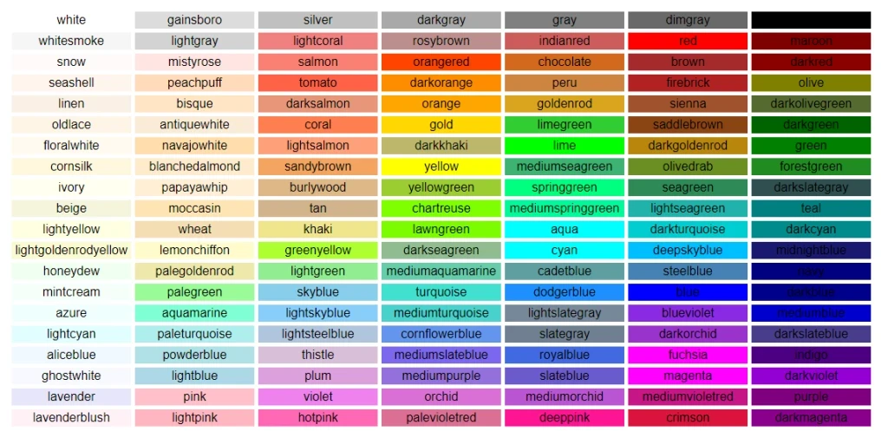
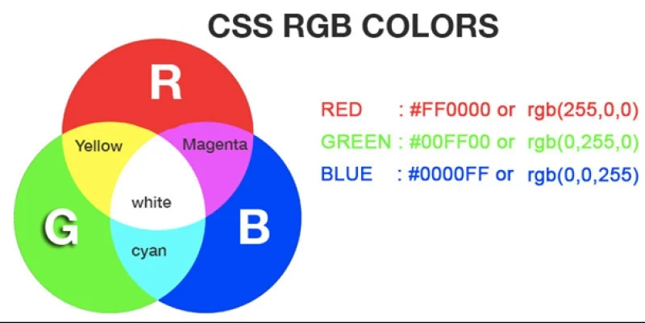

---

# Introduction to CSS

## 1. The Birth of CSS

When the web first appeared, browsers were mainly used for **scientific and academic purposes**. Early web pages were simple: mostly text, with very little visual design.

As the web became popular with the general public, users began to expect more:

* Colors 🎨
* Images and backgrounds
* Animations and visual effects
* Multimedia elements like video and sound

At first, developers tried to solve this by **adding more HTML tags**. However, this quickly became a problem:

* HTML documents became complex and messy
* Hundreds of new tags would be needed
* Mixing content with design made pages hard to maintain

This led to an important idea:
👉 **Separate content from design**

### What Is CSS?

**Cascading Style Sheets (CSS)** were created to handle **visual styling**, while HTML remained responsible for **structure and content**.

CSS allows developers to control:

* Colors
* Fonts
* Sizes
* Layout
* Borders
* Backgrounds

This separation makes web pages:

* Easier to read
* Easier to maintain
* More flexible and powerful

---

## 2. CSS Properties

CSS works using **properties**.
Each property has:

* A **name**
* A **value**

The browser reads these properties and renders the element accordingly.

### Common CSS Properties

| Property Name      | Description      | Example                              |
| ------------------ | ---------------- | ------------------------------------ |
| `color`            | Text color       | `color: red`                         |
| `height`           | Element height   | `height: 400px`                      |
| `width`            | Element width    | `width: 100%`                        |
| `background-color` | Background color | `background-color: rgb(255,204,221)` |
| `border`           | Element border   | `border: 1px solid black`            |
| `font-size`        | Text size        | `font-size: 2em`                     |
| `border-radius`    | Rounded corners  | `border-radius: 4px`                 |

There are **fewer than 100 core CSS properties**, but when combined, they can create very complex and visually impressive designs.

---

## 3. Element Styles (Inline CSS)

The simplest way to apply CSS is by using the **`style` attribute** directly inside an HTML element. This is called **inline styling**.

### Example: Inline Style

```html
<p style="color: blue; font-size: 16px;">
  This is an example of an inline style.
</p>
```

In this example, two styles are applied:

* `color: blue`
* `font-size: 16px`

Each property is separated by a **semicolon**.

---

### Example: Styled Block

```html
<div style="width:100%; height:200px; color:white; background-color:black">
  White text on black background
</div>
```

This creates:

* A full-width block
* A fixed height
* White text
* A black background

⚠️ Inline styles are useful for learning and quick tests, but they are **not recommended** for large or real-world projects. External CSS files are preferred (covered later).

---

## 4. Colors in CSS

Colors play a major role in making web pages visually appealing and easy to understand. CSS supports multiple ways to define colors.

---

---

### 1. Color Names

CSS supports **over 140 predefined color names**, making this the easiest method to use.

**Example:**

```html
<div style="color: lightblue;">Light blue text</div>
```

#### Common Color Names

| CSS Color Name |
| -------------- |
| red            |
| blue           |
| green          |
| yellow         |
| black          |
| white          |
| gray           |
| silver         |
| purple         |
| navy           |
| aqua           |
| lime           |
| fuchsia        |
| teal           |
| olive          |
| maroon         |
| orange         |
| brown          |
| pink           |
| gold           |

Color names are easy to read but limited in variety.

---

### 2. Hexadecimal Color Values

---

---

To define **any possible color**, CSS uses **hexadecimal values**.

Hex colors:

* Start with `#`
* Use six characters
* Represent **Red, Green, Blue** (RRGGBB)

Each pair controls the intensity of a color channel.

**Example:**

```html
<div style="color: #ff0000; background-color: #00ff00;">
  Red text on green background
</div>
```

* `#ff0000` → Red
* `#00ff00` → Green
* `#000000` → Black
* `#ffffff` → White

Hex values allow over **16 million colors**, making them extremely powerful and commonly used in professional design.

---

Nice choice 👍 This is where CSS really *clicks*. I’ll break this into **two clear lesson sections**, then end with a **guided hands-on exercise** where *you* do the thinking.

---

# Comparing Inline, Internal, and External CSS

CSS can be added to a web page in **three different ways**. Each has a purpose, but they are **not equal**.

---

## 1. Inline CSS

Inline CSS is written **directly inside an HTML element** using the `style` attribute.

### Example

```html
<p style="color: red; font-size: 18px;">
  This paragraph uses inline CSS.
</p>
```

### Characteristics

* Applies to **one element only**
* Written inside the HTML tag
* Highest priority (overrides other styles)

### Pros

* Quick for testing
* Easy to understand for beginners

### Cons

* Messy HTML
* Hard to maintain
* Not reusable

👉 **Use inline CSS only for learning or quick experiments.**

---

## 2. Internal CSS

Internal CSS is written inside a `<style>` tag in the `<head>` section of an HTML document.

### Example

```html
<head>
  <style>
    p {
      color: blue;
      font-size: 16px;
    }
  </style>
</head>
```

### Characteristics

* Applies to the **entire page**
* Uses CSS selectors
* Keeps styling separate from content (partially)

### Pros

* Cleaner than inline CSS
* Good for single-page projects
* Easier to update than inline styles

### Cons

* Styles cannot be reused across pages
* Not ideal for large websites

👉 **Use internal CSS for small projects or demos.**

---

## 3. External CSS

External CSS is written in a **separate `.css` file** and linked to the HTML document.

### HTML File

```html
<link rel="stylesheet" href="styles.css">
```

### CSS File (`styles.css`)

```css
p {
  color: green;
  font-size: 16px;
}
```

### Characteristics

* Fully separates HTML and CSS
* Can style **multiple pages**
* Most professional approach

### Pros

* Clean and organized
* Reusable styles
* Easy maintenance
* Best performance for real websites

### Cons

* Requires managing extra files

👉 **This is the preferred and professional way to use CSS.**

---

## Comparison Summary

| Feature     | Inline          | Internal         | External             |
| ----------- | --------------- | ---------------- | -------------------- |
| Location    | Inside HTML tag | `<head>` section | Separate `.css` file |
| Reusability | ❌ No            | ⚠️ Limited       | ✅ Yes                |
| Clean code  | ❌ No            | ⚠️ Medium        | ✅ Yes                |
| Best for    | Quick tests     | Small pages      | Real projects        |
| Priority    | Highest         | Medium           | Lowest               |

📌 **CSS Priority Rule:**
Inline → Internal → External

---

# Hands-On Styling Exercise 🧠💻

You’re going to **style the same content in three different ways** and observe what happens.

---

## Step 1: Start with Plain HTML

Create this basic HTML (no CSS yet):

```html
<!DOCTYPE html>
<html>
<head>
  <title>CSS Practice</title>
</head>
<body>

<h1>My First CSS Page</h1>
<p>This is a paragraph.</p>
<p>This is another paragraph.</p>

</body>
</html>
```

👉 **Question:**
How many paragraphs do you see? Do they look styled or plain?

---

## Step 2: Add Inline CSS

Add an inline style to **only the first paragraph**:

* Change its color
* Increase its font size

👉 **Think:**
Why does only one paragraph change?

---

## Step 3: Add Internal CSS

Now add this inside `<head>`:

```html
<style>
  p {
    color: blue;
  }
</style>
```

👉 **Observe carefully:**

* What happens to both paragraphs?
* Does the inline-styled paragraph change or stay the same?

📌 **Hint:** CSS priority rules apply here.

---

## Step 4: Imagine External CSS

Pretend this is inside a file called `styles.css`:

```css
p {
  color: green;
}
```

👉 **Question:**
If inline, internal, and external CSS all style the same paragraph:

* Which color wins?
* Why?

(Answer this out loud or in writing — teaching your brain matters.)

---

## Summary

* CSS was created to separate **design from content**
* HTML structures content, CSS styles it
* CSS uses **properties and values**
* Inline styles apply CSS directly to elements
* Colors can be defined using **names** or **hex values**

---

## Quick Check (Mini Quiz)

Answer without looking back 👀

1. Which CSS type has the **highest priority**?
2. Which CSS type is **best for real websites**?
3. Why is inline CSS bad for large projects?
4. Where should the `<style>` tag be placed?