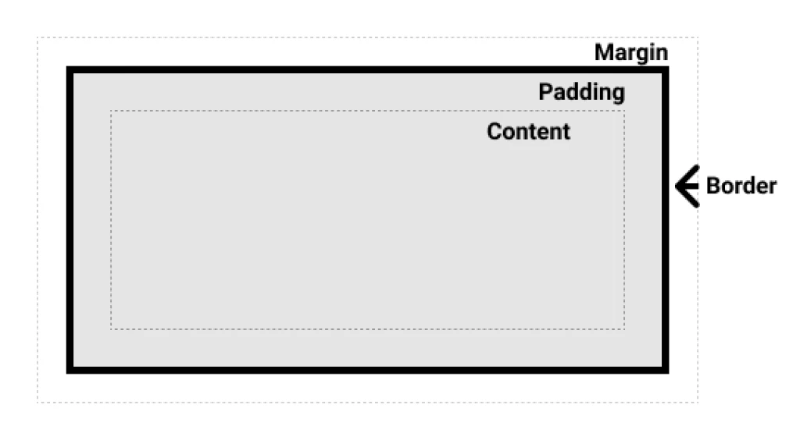

---

# 9. HTML Block Model

The **HTML Block Model** (often called the *box model* in CSS context) describes how HTML elements are structured, displayed, and spaced on a web page. Understanding the block model is essential for building **well-structured layouts**, controlling spacing, and designing visually appealing web pages.

HTML elements are generally divided into **block elements** and **inline elements**, each behaving differently in terms of layout and spacing.

---

## 9.1 Block Elements

**Block elements**:

* Always start on a **new line**
* Take up the **full available width** of their container by default
* Can contain **other block elements and inline elements**

Block elements are commonly used to define **page structure**.

---

### Common Block Elements

| HTML Tag        | Description                             |
| --------------- | --------------------------------------- |
| `<div>`         | Generic container for grouping elements |
| `<p>`           | Paragraph of text                       |
| `<h1>` – `<h6>` | Headings (from highest to lowest level) |
| `<ul>`, `<ol>`  | Unordered and ordered lists             |
| `<li>`          | List item                               |
| `<section>`     | Thematic grouping of content            |
| `<article>`     | Independent, self-contained content     |
| `<aside>`       | Related or supplementary content        |
| `<header>`      | Introductory or navigational content    |
| `<footer>`      | Footer for a page or section            |
| `<nav>`         | Navigation links                        |
| `<main>`        | Main content of the document            |

---

### Example of a Block Element

```html
<div>
  <h1>Title</h1>
  <p>This is a paragraph of text inside a block element.</p>
</div>
```

**Explanation:**

* `<div>` creates a block container
* `<h1>` and `<p>` are stacked vertically
* Each element occupies its own line

---

## 9.2 Inline Elements

**Inline elements**:

* Do **not** start on a new line
* Take up **only as much width as their content**
* Can only contain **text or other inline elements**

Inline elements are mainly used for **text formatting and small content pieces**.

---

### Common Inline Elements

| HTML Tag                            | Description              |
| ----------------------------------- | ------------------------ |
| `<span>`                            | Generic inline container |
| `<a>`                               | Hyperlink                |
| `<strong>`, `<b>`                   | Bold emphasis            |
| `<em>`, `<i>`                       | Italic emphasis          |
| ``                             | Image                    |
| `<code>`                            | Code snippet             |
| `<label>`                           | Label for form fields    |
| `<input>`, `<select>`, `<textarea>` | Form controls            |

---

### Example of Inline Elements

```html
<span>
  This is text with <strong>bold</strong> and <em>italic</em> styles.
</span>
```

**Explanation:**

* All content appears on the **same line**
* Inline elements flow naturally within text

---

## 9.3 Components of the Block Model

Every block-level element is rendered as a **rectangular box**, made up of four distinct parts:



1. **Content** – The actual text, image, or media
2. **Padding** – Space between content and border
3. **Border** – Surrounds the padding and content
4. **Margin** – Space outside the border separating elements

---

### Visual Representation (CSS)

```css
.element {
  width: 200px;           /* Content width */
  padding: 10px;          /* Space inside border */
  border: 2px solid red;  /* Border */
  margin: 20px;           /* Space outside border */
}
```

---

### Example Demonstrating the Block Model

#### CSS

```css
.box {
  width: 200px;
  padding: 10px;
  border: 2px solid red;
  margin: 20px;
}
```

#### HTML

```html
<div class="box">
  This is an example of the HTML block model.
</div>
```

**Explanation:**

* The content area is 200px wide
* Padding adds space inside the box
* Border surrounds content and padding
* Margin creates space between this box and others

---

### 9.3.1. `display: block` vs `display: inline-block`

#### `display: block`

A **block-level element**:

* Starts on a **new line**
* Takes up the **full width** of its parent by default
* You can set **width, height, margin, padding**

### Common block elements

```html
<div> <p> <section> <article> <header>
```

### Example

```html
<div class="box">Box 1</div>
<div class="box">Box 2</div>
```

```css
.box {
  width: 150px;
  height: 100px;
  background: lightblue;
}
```

**Result:**

* Box 1 appears on its own line
* Box 2 appears on the next line

📌 Block elements stack **vertically**

---

## `display: inline-block`

An **inline-block element**:

* Flows **inline** (side by side)
* Allows **width and height**
* Respects **margin and padding**

### Why it exists

* `inline` elements → no width/height
* `block` elements → force new lines

    👉 `inline-block` gives you the **best of both**

### Example

```html
<div class="item">A</div>
<div class="item">B</div>
<div class="item">C</div>
```

```css
.item {
  display: inline-block;
  width: 100px;
  height: 80px;
  background: coral;
  margin: 10px;
}
```

**Result:**

* A, B, C sit **next to each other**
* Each has its own box size

📌 Inline-block elements align **horizontally**

---

## Quick Comparison Table

| Feature                | `block`       | `inline-block`            |
| ---------------------- | ------------- |---------------------------|
| Starts on new line     | ✅ Yes        | ❌ No                     |
| Can sit side by side   | ❌ No         | ✅ Yes                    |
| Width & height allowed | ✅ Yes        | ✅ Yes                    |
| Margin & padding       | ✅ Yes        | ✅ Yes                    |
| Typical use            | Page sections | Buttons, cards, nav items |

---

## When to Use Which

* Use **block** for:

    * Layout sections
    * Containers
    * Full-width elements

* Use **inline-block** for:

    * Buttons
    * Menu items
    * Small cards without Flexbox

---

# 2. Teaching `box-sizing`

## The CSS Box Model (Quick Reminder)

Every element consists of:

```
content
padding
border
margin
```

By default, **width applies only to content**.

---

## `box-sizing: content-box` (Default)

```css
.box {
  width: 200px;
  padding: 20px;
  border: 5px solid black;
  box-sizing: content-box;
}
```

### Actual width

```
200 (content)
+ 40 (padding)
+ 10 (border)
= 250px total
```

😤 This surprises beginners a lot.

---

## `box-sizing: border-box` (Recommended)

```css
.box {
  width: 200px;
  padding: 20px;
  border: 5px solid black;
  box-sizing: border-box;
}
```

### Actual width

```
200px total (content + padding + border)
```

✅ Predictable

✅ Easier layouts

✅ Industry standard

---

## The key idea (one sentence)

> With `box-sizing: border-box`, **the browser works backwards**: it treats `width` as the *total outer size* and **subtracts padding and border from it** to calculate the content size.

---

## Step-by-step: what really happens

You write:

```css
.box {
  width: 200px;
  padding: 20px;
  border: 5px solid black;
  box-sizing: border-box;
}
```

### What `width: 200px` means here

Because of `border-box`:

```
TOTAL WIDTH = 200px
```

That 200px must include:

* left + right padding
* left + right border
* remaining content width

---

## Browser’s calculation (this is the missing piece)

### 1️⃣ Known values (hardcoded)

* Padding: `20px` left + `20px` right = **40px**
* Border: `5px` left + `5px` right = **10px**

### 2️⃣ Subtract from total width

```
Content width
= 200 − 40 − 10
= 150px
```

### 3️⃣ Final box breakdown

```
| 5px | 20px | 150px | 20px | 5px |
```

📌 The **content shrinks**, not the box.

---

## Why this feels “magical” at first

In `content-box`:

* Width is fixed
* Padding & border *add outward*

In `border-box`:

* Width is fixed
* Padding & border *eat inward*

That’s the mental flip 🔄

---

## Visual comparison

### `content-box`

```
width = content only
[ border | padding | content | padding | border ]
TOTAL > width
```

### `border-box`

```
width = everything
[ border + padding + content ]
TOTAL = width
```

---

## What if padding + border exceed width?

Example:

```css
width: 50px;
padding: 30px;
border: 5px;
```

Calculation:

```
Content = 50 − 60 − 10 = −20px
```

👉 Browsers clamp content to **0px**

👉 Padding and border still render

👉 Content may overflow or disappear

This is why **reasonable sizing still matters**, even with `border-box`.

---

## Teaching tip (how I’d explain to students)

> “Think of `width` as a **fixed box**. Padding and border must *fit inside it*. If they grow, the content sacrifices space.”

---

## Best Practice (Teach This Early)

```css
*,
*::before,
*::after {
  box-sizing: border-box;
}
```

📌 This makes **all elements easier to size and align**

---

## Exam-Ready Summary

* **block** elements start on a new line and take full width
* **inline-block** elements flow inline but keep box properties
* **content-box** adds padding/border *outside* the width
* **border-box** includes padding/border *inside* the width

---

## Key Differences: Block vs Inline

| Feature                    | Block Elements        | Inline Elements    |
| -------------------------- | --------------------- | ------------------ |
| New line                   | Yes                   | No                 |
| Width                      | Full width by default | Content width only |
| Can contain block elements | Yes                   | No                 |
| Used for layout            | Yes                   | No                 |

---

# Practical Exercises

---

## Exercise 1: Block Element Structure

### Task

Create an HTML document that contains a `<div>` element with a header and a paragraph. Apply CSS styles to demonstrate the block model.

### Requirements

* Use a `<div>` container
* Nest an `<h1>` inside the `<div>`
* Nest a `<p>` inside the `<div>`
* Apply CSS for width, padding, border, and margin

---

### Sample Solution

```html
<!DOCTYPE html>
<html lang="en">
<head>
  <meta charset="UTF-8">
  <title>Block Element Example</title>
  <style>
    div {
      width: 400px;
      padding: 20px;
      border: 2px solid black;
      margin: 30px;
    }
  </style>
</head>
<body>

  <div>
    <h1>Block Element Title</h1>
    <p>This paragraph is inside a styled block element.</p>
  </div>

</body>
</html>
```

---

## Exercise 2: Block Model Demonstration

### Task

Create an HTML document that demonstrates the block model using a `<div>` with the class `box`.

### Requirements

* Use a `<div>` with `class="box"`
* Set width to **300px**
* Set padding to **20px**
* Set border width to **3px**
* Set margin to **30px**

---

### Sample Solution

```html
<!DOCTYPE html>
<html lang="en">
<head>
  <meta charset="UTF-8">
  <title>Block Model Example</title>
  <style>
    .box {
      width: 300px;
      padding: 20px;
      border: 3px solid blue;
      margin: 30px;
    }
  </style>
</head>
<body>

  <div class="box">
    This box demonstrates the HTML block model.
  </div>

</body>
</html>
```

---

## Lesson Summary

* The HTML Block Model explains how elements are displayed and spaced
* Block elements form the **layout structure**
* Inline elements format **content within blocks**
* Padding, border, and margin control spacing and appearance
* Mastering the block model is essential for CSS layout design

---