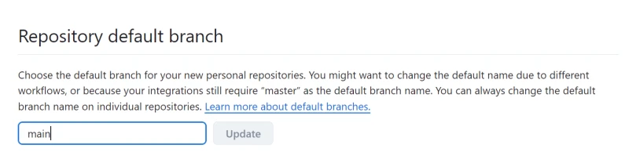
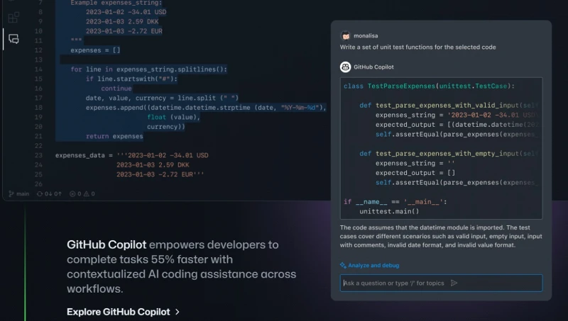
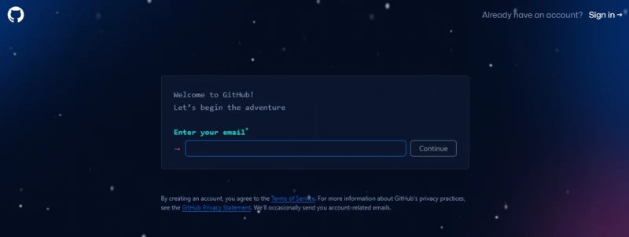
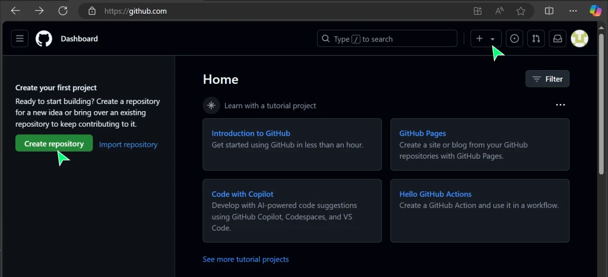
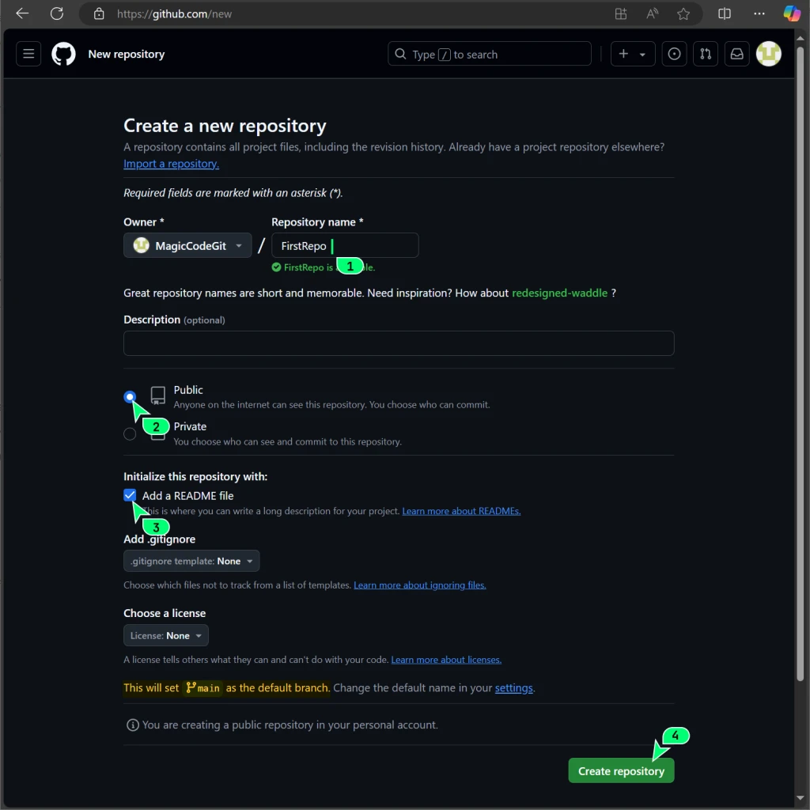
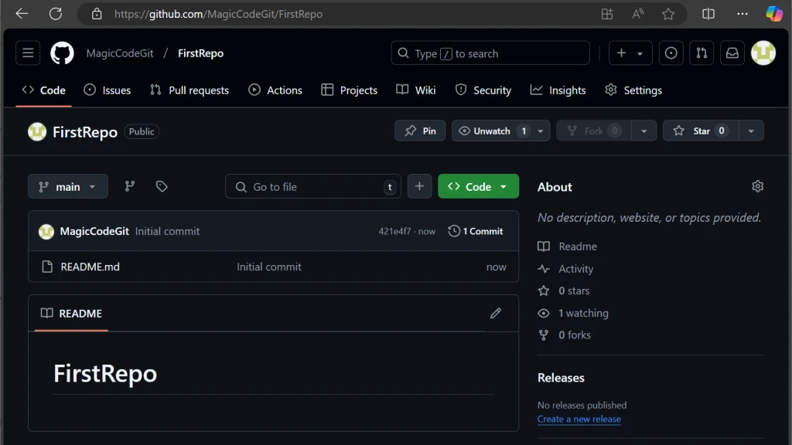
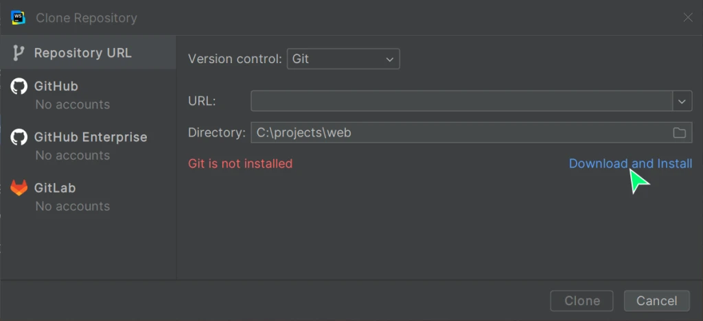

# 9.0 A Bit of History

One of the key elements of Git is **branches**, which let you work on different features or versions of your program at the same time.

Originally, in Git DVCS, the default branch was called **master**. By default, every Git repository had a master branch. Developers rarely deleted it since it played an important role in development.

In the summer of 2020, amidst protests and social unrest, the use of terms like *master* and *slave* in IT sparked a heated debate. Different alternatives to *master* were proposed, like *default* and *primary*. But eventually, the term **main** became the most popular.

GitHub took steps to move away from the term *master* when initializing a Git repository. You can switch from *master* to *main* in your GitHub account settings at Repositories or by running this command:



```
$ git branch -m master main
```

In some learning materials, you might still encounter the term *master*. To learn more about the switch to *main*, check out these links:

* Git Tower: Rename Master to Main
* GitHub: Renaming

---

# 9.1 What is Git and Why You Need It

**Git** is a powerful version control system used to track changes in source code during software development. It helps devs save different versions of files and coordinate the teamwork on a shared project.

## Key Concepts of Git

### Repository

A **repository** (or "repo") is the place where the entire project history is stored, including all changes and file versions. In Git, a repository includes:

* A working directory
* An index (or staging area)
* An object database

### Commits

A **commit** is a saved state of the project. Each commit in Git contains info on:

* What changes were made to the project
* By whom
* When

Commits form the project history and let you revert to any previous version.

### Branches

A **branch** is an independent line of development. By default, Git creates the **main** branch (formerly *master*). You can create new branches for developing new features or fixes and then merge them back into the main branch.

### Merge and Rebase

**Merge** and **rebase** are two ways to integrate changes from one branch into another.

* **Merge** combines the histories of the two branches by creating a new commit.
* **Rebase** moves the commits of one branch on top of another, rewriting commit history.

---

# 9.2 Key Git Commands

Here's a table with the main Git commands for version control:

| Command      | Description                                                                    |
| ------------ | ------------------------------------------------------------------------------ |
| `git init`   | Initializes a new Git repository in the current directory.                     |
| `git clone`  | Clones a repository from the URL to a new directory.                           |
| `git add`    | Adds files to the index for the next commit.                                   |
| `git commit` | Saves staged changes into the repository.                                      |
| `git push`   | Sends changes from the local repository to the remote one.                     |
| `git pull`   | Updates the current branch with the latest version from the remote repository. |
| `git branch` | Displays, creates, or deletes branches.                                        |
| `git merge`  | Merges changes from the specified branch into the current branch.              |
| `git rebase` | Reapplies changes onto a new base (usually another branch).                    |

These commands represent the core tools for working with Git, letting you manage code changes, branches, and merges in projects of any size. We'll dig deeper into them in the next lectures.

---

# 9.3 Three Places to Store Code

When you start using a version control system for your code, your code, roughly speaking, will be stored in three places:

## 1. Remote Repository

This is a centralized place for storing your code, usually hosted on services like:

* GitHub
* GitLab
* Bitbucket

They provide centralized code storage and are the foundation for collaboration.

Remote repositories let developers:

* Share their changes
* Sync efforts
* Track the project's change history

A remote repository also acts as an integration point for automation processes, like building, testing, and deploying applications.

## 2. Local Repository

A **local repository** is your personal copy of the code stored on your computer. In this repository, you can perform all Git operations (commits, branching, merging) without needing an internet connection.

Local repositories let developers:

* Work isolated from teammates
* Experiment
* Create new features
* Fix bugs

Before changes are merged and pushed to the remote repository.

## 3. Working Directory

The **working directory** on your computer contains the project's current files you’re working on. This is the place where you can:

* See and modify files
* Add new functionality
* Fix bugs

After making changes, you can:

1. Add them to the staging area
2. Commit them to the local repository

The working directory is tied to the current branch in your repository, and switching branches changes the content of the working directory.

These components collectively provide a robust infrastructure for managing source code, enabling developers to maintain project history, collaborate, and share responsibility for the code.

---

# 9.4 GitHub — The Most Popular Free Repository

GitHub is the largest web platform for hosting source code, using the Git version control system. Founded in 2008, it quickly became one of the key tools for developers around the world.



GitHub lets users:

* Create repositories to manage projects
* Control and track changes in code
* Collaborate with other developers
* Work on projects either publicly or privately

It offers features like:

* Forks
* Branches
* Pull requests
* Merges

Making it easy for developers to work together on projects.

GitHub also includes functionality for:

* Issue tracking
* Feature requests
* Task management
* Wikis for each project

The platform integrates with loads of tools and services, offering extensive functionality for automating development, testing, and deploying apps.

GitHub supports a vast community of developers where best practices in programming, project management, and much more are actively discussed. This makes it not only a tool for project management but also a hub for a community where developers can share knowledge and experiences.

---

# 9.5 Signing Up on GitHub



## Step 1

Go to [https://github.com](https://github.com)

## Step 2

Sign up.

## Step 3

Click the **New repository** button to create a new repository.



## Step 4 — Set the Parameters for the Repository

* Repository name
* Public or private. For starters, pick "Public"
* Add a README file – we'll need it later.

Click **Create repository**



### Parameters We Skipped for Now

* **.gitignore file** – We'll skip this for now. It's useful for excluding specific files from your repository.
* **License** – It defines how others can use and share your work.
* **Branch main** – By default, GitHub uses *main* as the name of the primary branch in your repository.

Step 4. Here's our first repository.



---

# Installing Git on Your PC



This one's easy: click the first Google link, install it, and you're done.

If you're using WebStorm, you don’t need to install Git separately. WebStorm will prompt you to install Git during initial setup if it detects that Git isn’t installed on your system.

---

## Installation for Windows

As usual, you need to download the exe file and run it. Get the Git installer from the official site:

[https://git-scm.com/downloads](https://git-scm.com/downloads)

---

## Installation for Linux

Typically, git is already installed and included in Linux distributions.

To check, open the terminal and type:

```
git --version
```

Use your distro’s package manager to install Git. For example, on Ubuntu or Debian, you can use the following command:

```
sudo apt-get install git
```

---

## Installation on macOS

Same thing here, first check if Git is already installed (see above, like on Linux).

---