# 10. Working with GitHub from IntelliJ IDEA

---

# 10.1 Cloning a Repository

Remember I told you about the 3 places where files are stored? **Remote repository, local repository, and working directory.**

Now, you’ll need to clone your remote repository (the one you created on GitHub) to your local repository (the repository on your computer).

So fire up WebStorm and let's get started…

---

### Step 1

Close the project if it's open. Then click **Clone Repository**.

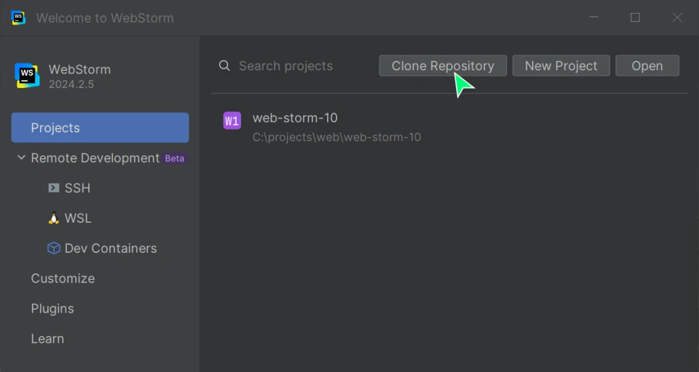

---

### Step 2

Enter the URL of your remote repository that you want to clone to your computer.

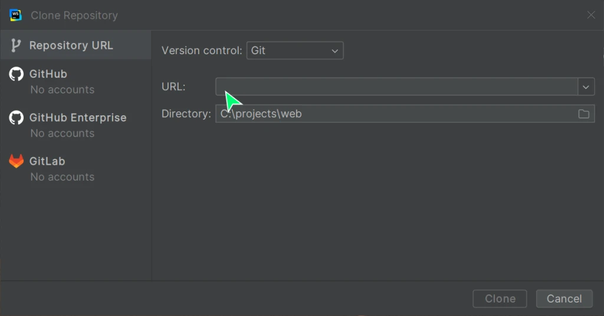

This method is really useful if you're cloning someone else's repository.

If you're cloning your own repo, it's easier to log in to GitHub through WebStorm:

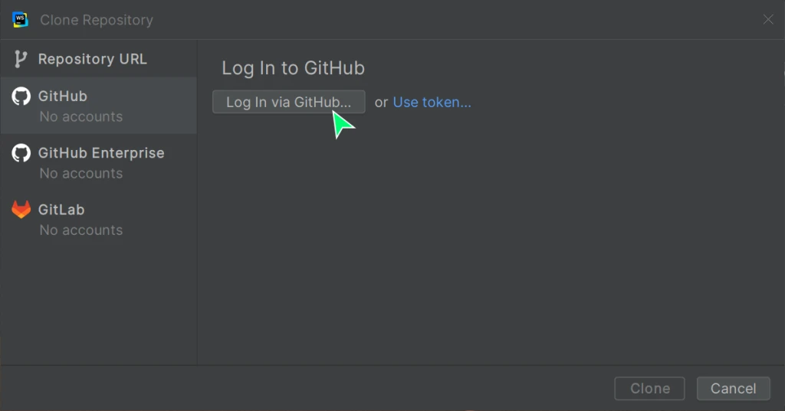

Select your project and hit **Clone**.

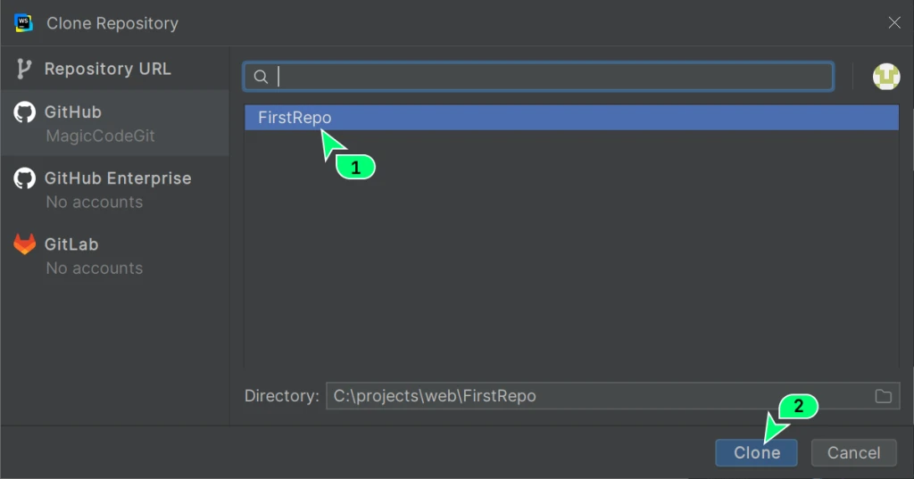

---

### Step 3. Trust no one. Not even yourself.

WebStorm is warning you not to run code from unknown repositories. Since this is your own repo, check the box to trust it.

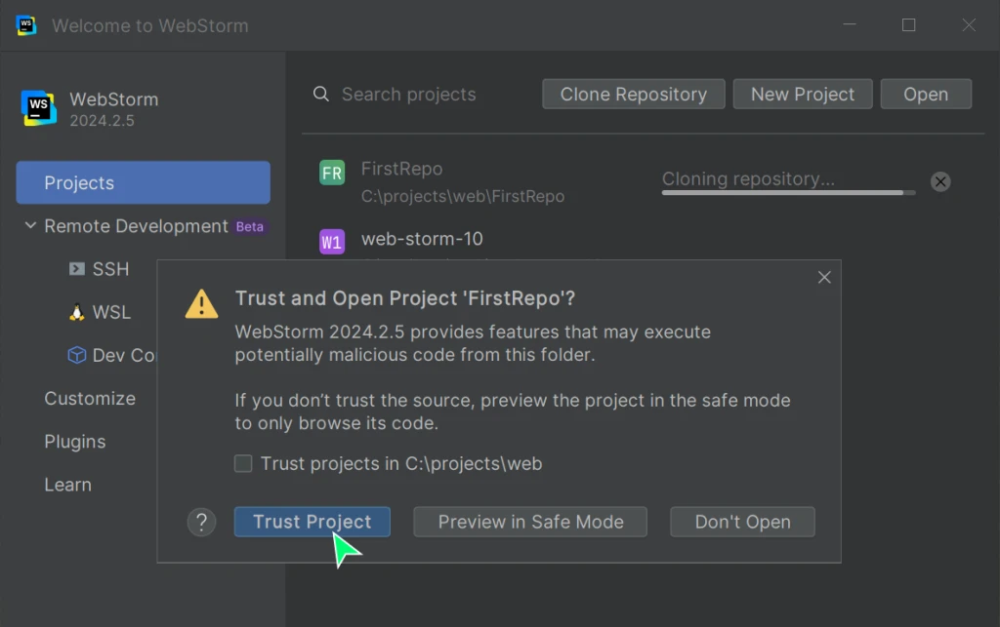

---

### Step 4

The built-in antivirus in Windows might warn you that some unknown files have shown up. Antivirus software generally doesn’t like programs it doesn’t recognize.

BUT! We’re going to create those very programs, so we ask the IDE to tell the antivirus not to block your future creations.

Click the **"Automatically"** button, and then — **"YES"**.


---

# 10.2 The First Commit

If you cloned a freshly created repository, it will only contain one file — **README.md**

---

### Step 1

Open the README.md file.

**Important!**
The `md` extension means **Markdown** — it’s a simple format for styling plain text files. You can check out how it works by clicking the button in the top-right corner.

Edit this file however you want: you can write any welcome message or a description of the repository.

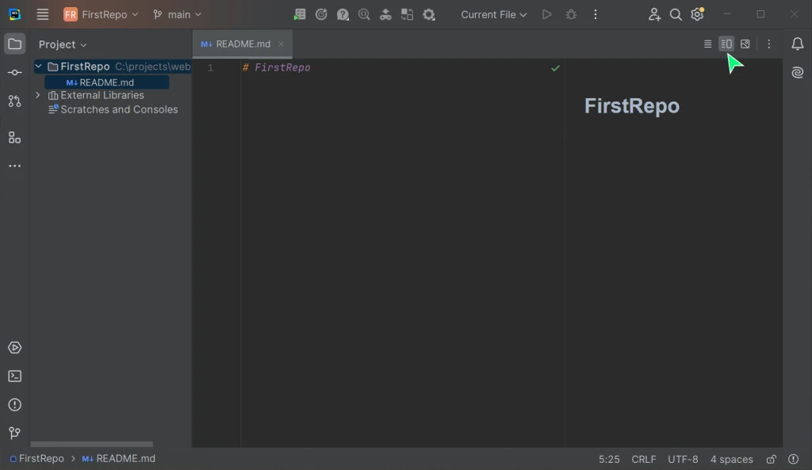

---

### Step 2

After you’ve made changes to the file, WebStorm will highlight it in **blue** in the file tree on the left.

Files that are changed but not yet committed to the local repository show up in blue.

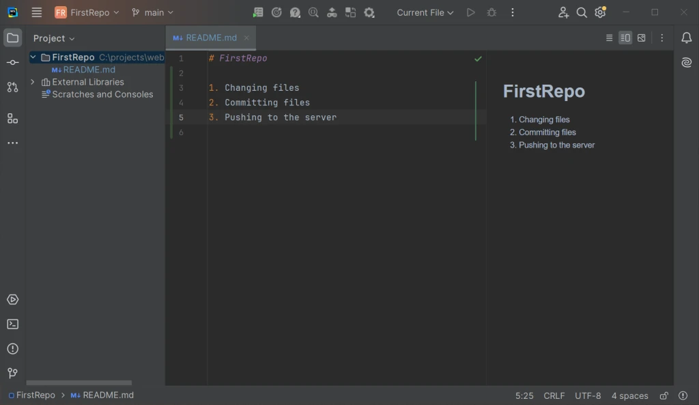

---

### Step 3. Commit

Once you’ve made all the planned changes to your file or files (and made sure they’re good to go), you need to commit them to your local git repository.

Right now, they’re just sitting in your working directory.

To do this, click the **Commit** button and select all the files whose changes you want to add to the local repository.

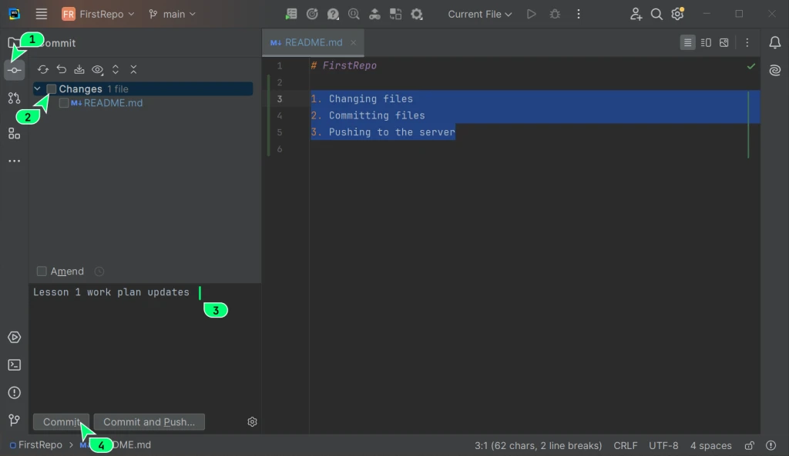

---

### Step 4

Hit the **Commit** button.

---

### Step 5. Verification

Switch back to your project and check: if the files are no longer highlighted in blue, it means all the changes from your working directory have been successfully committed to your local repository.

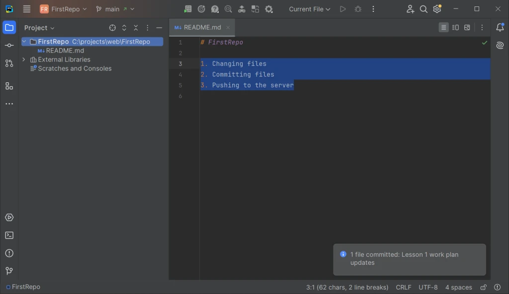

---

# 10.3 Working with Files

---

### Step 1

Let's create a file in WebStorm.

We're writing HTML code — so let's call it **main.html**

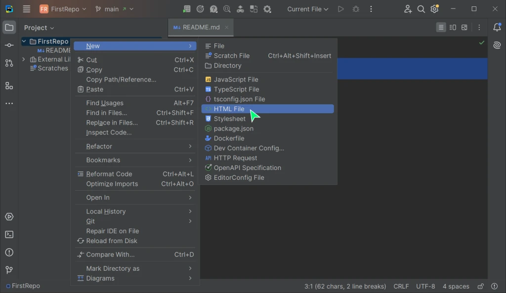

---

### Step 2. Add the file to the local repository

Once WebStorm notices you’ve created a file, it’ll immediately suggest adding it to your local repository.

WebStorm tracks changes only for those files in your working directory that are already in your local repository — only those it will mark with blue.

If the file exists in your working directory but is not in the local repository, it gets marked **red**.


In principle, you can always hit **Add**, but this time let’s hit **Cancel** and add the file manually so you know how to do it.

---

### Step 3

Write your favorite code in the file.

For example:

```html
<h1>FIRST COMMIT</h1>
```

---

### Step 4

Now let's add our file **main.html** to the local repository.

Simply right-click anywhere inside the file and choose:

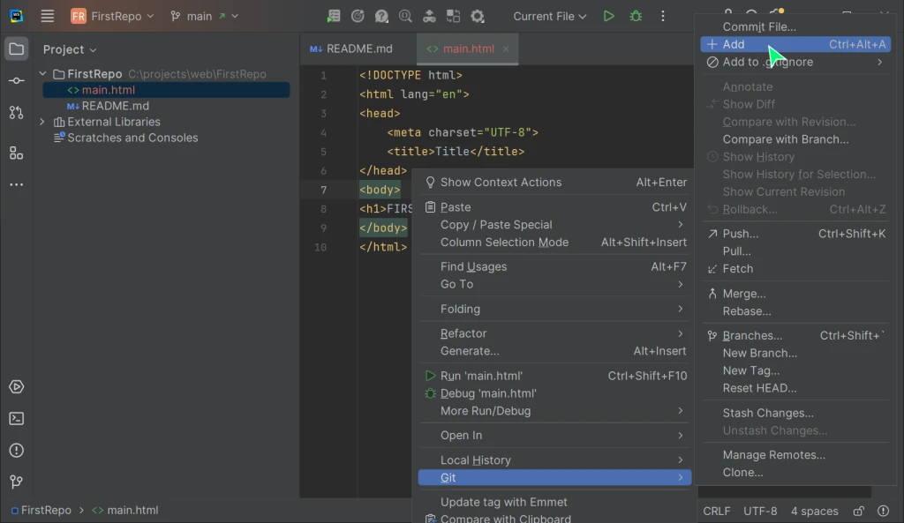

Git → Add File

If everything went smoothly, the added file will glow **green**.

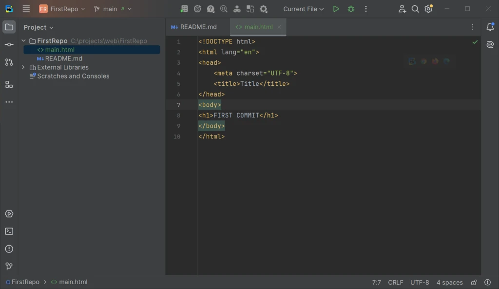

---

### Step 5

Then commit it as usual.

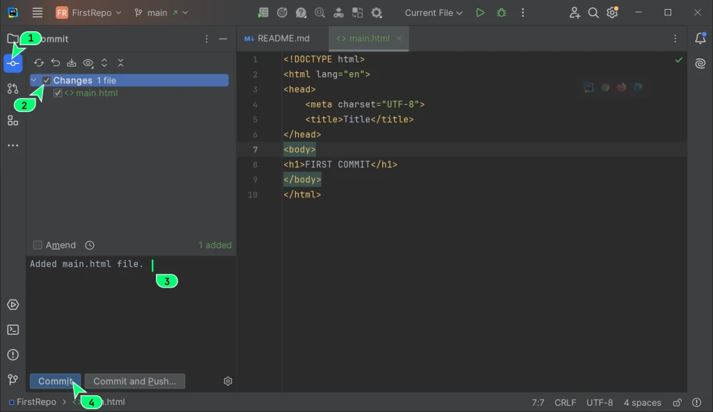

---

# 10.4 First Push

Now we need to push our changes from the local repo to the remote repo on GitHub.

When a bunch of developers are working on the same project, this is the way they sync up their code changes.

---

### Step 1

Click the **Push** button.

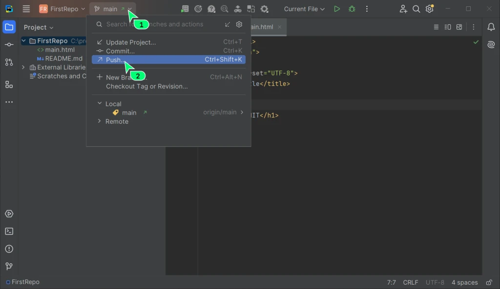

Honestly, it's super easy: you just gotta use the Push button in the top menu of your IDE.

---

### Step 2. Confirm your commits

At this step, you can review all the changes you made and make sure you didn't accidentally break something important.

Or forget to add a file that's needed by other files.

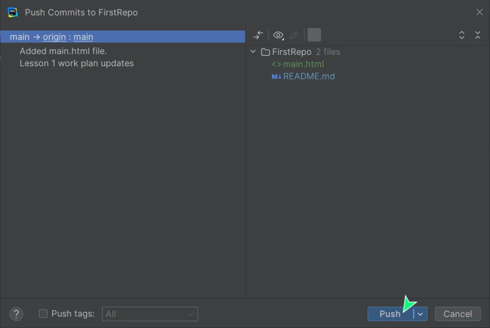

---

### Step 3. Check it out

If everything went smoothly, you'll see a message confirming the push.

---

### Step 4

Now go ahead, open your GitHub repo, and check it out.

The magic of tech!

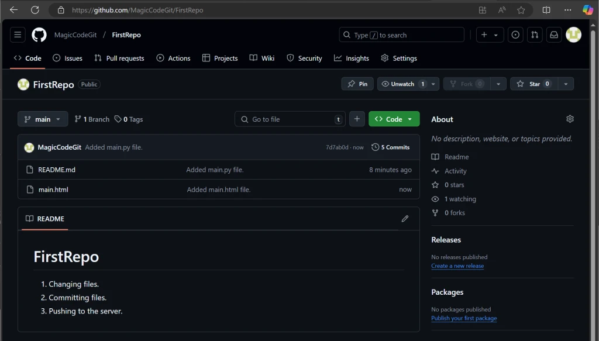

---

# 10.5 Using .gitignore Files

If you’ve added some helper files to your project and don’t want them accidentally ending up in your repository, you can add them to an exclusion list.

For this, the **.gitignore** file is your best friend.

It's super handy when there are files you don’t need to store in version control (like temporary files, logs, passwords).

---

### Step 1

First, create a file in the project directory. For example, a `.txt` file with any name.

After creating the file, click **Cancel**.

---

### Step 2

Right-click on the created file `hacky_fix_that_somehow_works.txt` in the "Project" window.

Go to:

Git → Add to .gitignore → Add to .gitignore

This option adds the selected file to the .gitignore file at the root of your project.

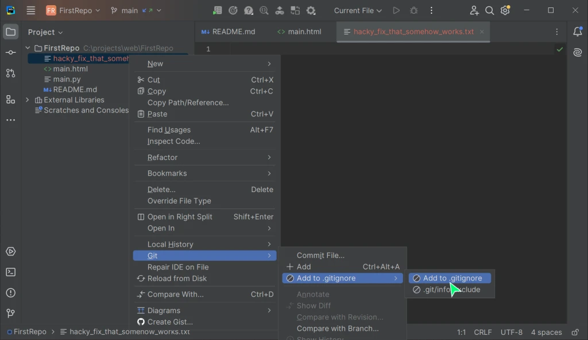

---

### Step 3

Create the .gitignore in your project.

When we created the repository, we didn’t create a .gitignore file.

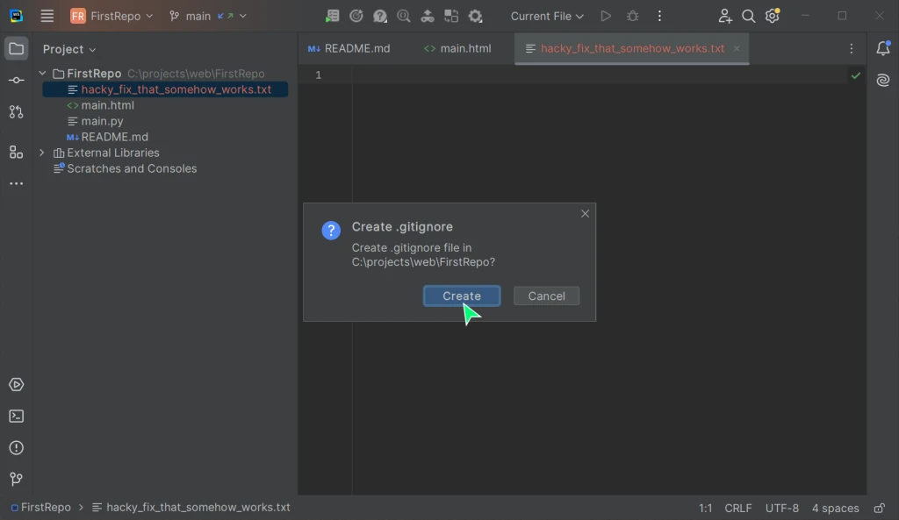

WebStorm will automatically add the filename `hacky_fix_that_somehow_works.txt` to your .gitignore file.

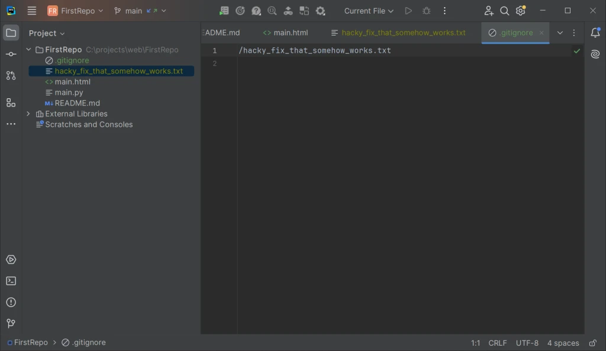

After adding files to .gitignore, they will appear in **brown color**.

When you try to commit changes, these files will be ignored.

The .gitignore file only affects files that have not yet been committed to the Git repository.

If a file has already been committed, you'll need to remove it from the repository first in order to ignore it.

Don’t forget to commit the .gitignore file itself to the Git repository and push the changes to GitHub so that all project members use the same file ignoring rules.

---

# Excluding Local Files with .git/info/exclude

Besides the .gitignore file, which excludes files for all project users, Git also provides a way to create local ignore rules with:

```
.git/info/exclude
```

These rules won’t be committed to the repository and apply only to your local copy of the project.

This is useful, for instance, for ignoring files created by your IDE that shouldn’t end up in version control.

**Important:** Local ignore rules apply only to your local repository copy.

---

# Rules for .gitignore

The .gitignore file contains patterns for file and folder names that Git should ignore.

Blank lines are ignored.

To add a comment, start a line with `#`.

---

## Patterns

`*` — matches any number of any characters.
Example: `*.log` ignores all files with the `.log` extension.

`?` — matches any single character.
Example: `temp?.txt` ignores files like `temp1.txt`, `temp2.txt`, etc.

`[]` — specifies a range of characters.
Example: `[abc]` matches any of the characters a, b, or c.

`!` — excludes files matching the pattern.
Example: `!important.txt` will track `important.txt`, even if there’s a rule like `*.txt`.

`/` — at the start of a pattern indicates the repository root.
Example: `/temp/` ignores the temp folder in the root.

`**` — matches any number of nested directories.
Example: `**/temp` ignores temp folders at any nesting level.

---

# Example .gitignore File

```
# Logs
logs/*
*.log

# WebStorm-created folders
.idea/
*.iml

# Temp files
*.tmp
*.swp
*~

# Files generated during project build
dist/
build/

# Dependencies
node_modules/
bower_components/

# Config files
.eslintrc.js
.prettierrc.js

# Test data
coverage/
cypress/screenshots/
cypress/videos/
```

---

# Ready-to-Use Templates

Collection of .gitignore files for various programming languages and development environments:

[https://github.com/github/gitignore](https://github.com/github/gitignore)

gitignore.io — a web service designed to help you generate .gitignore files

---