# Working with Git Branches in IntelliJ IDEA

---

# 11.1 Git Branches

Working with branches in Git — it's one of the key aspects of version control that lets you work on multiple lines of development in a single repository at the same time. Branching makes Git a powerful tool for collaboration, experimenting, and managing different versions of a project.

## Git Branches

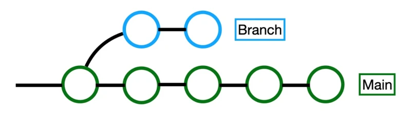

You can think of branches in git as folders that git uses to copy your project. You have your main project folder in your local repository — **main**, and git can create copies of this folder so you can experiment in them without messing up the main, stable code. These copy-folders are called branches — branches.

Branches are alternative versions of code. Say, you want to make some changes in a big project, run an experiment you're not entirely sure about. How would you do it without git?

You could copy the project into a new folder and try changing everything in there. If you like the result, you could copy it back into the main folder. If not, you just forget about it—or delete it entirely.

Or let’s take an example from real life. Say, writing a book:

You’ve got your book draft (the main branch).
You want to try a different ending (creating a new branch).
You write the new ending in a separate document (working in the new branch).
If the new ending is better, you replace the old one in the draft (merging branches).
You delete the separate document with the new ending (deleting the branch).

---

# 11.2 Creating Branches

Creating a branch in WebStorm is super easy.

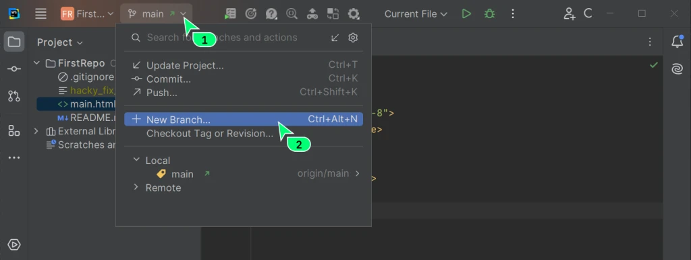

Enter the branch name.

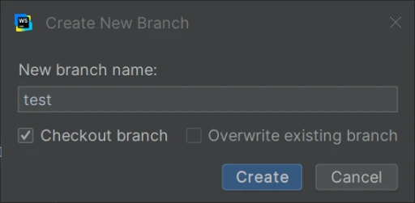

WebStorm will immediately display the name of your current branch at the top of the menu.

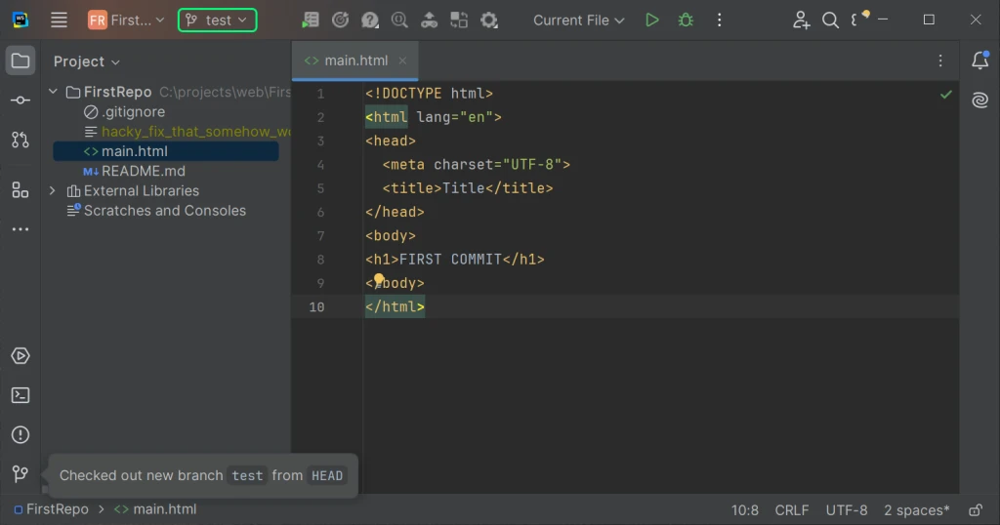

What was there before?

There was the name of your first and main branch — **main**.

Now it says **test**, which means Git (with WebStorm's help) not only created a new branch but also switched to it right away.

Let’s add some code to the main.html file in the current branch **test** and commit it.

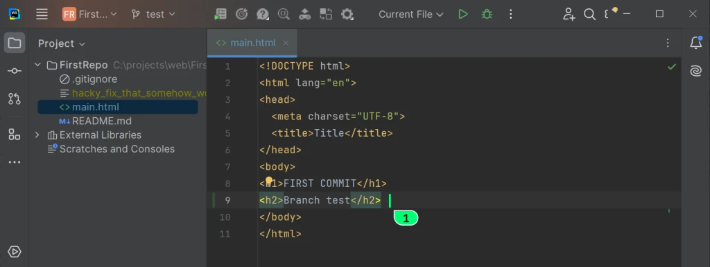

---

# 11.3 Switching Between Branches

## Step 1: Choose a branch

Now let's switch to our old branch. Click on the top menu.

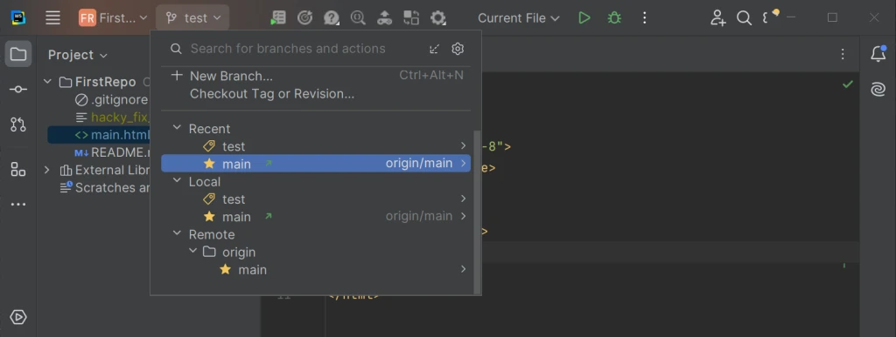

Don't freak out — it's all simple here:

### Local

This is the list of branches in your local Git repository. There are two:

* test
* main

### Remote

This is your remote repository, which is hosted on the GitHub server. We pushed your changes there, but the new branch isn't there, which makes sense.

The remote repo is named **origin**, and it only has the **main** branch.

### Recent

This is simply a list of the last branches you worked with: WebStorm adds this for convenience and speed.

The name **origin/main** next to the local repo name is the name of the remote repo it’s currently synced with, and where the changes will be pushed.

---

## Step 2: Pull the branch code into the current folder

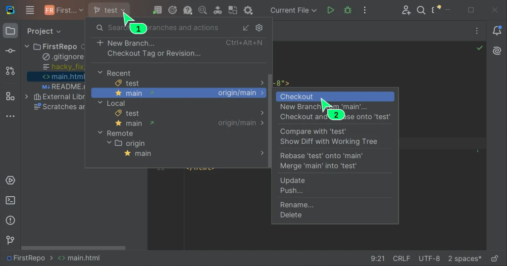

Switch to the branch and load its code into your working directory.

---

## Step 3: Verify

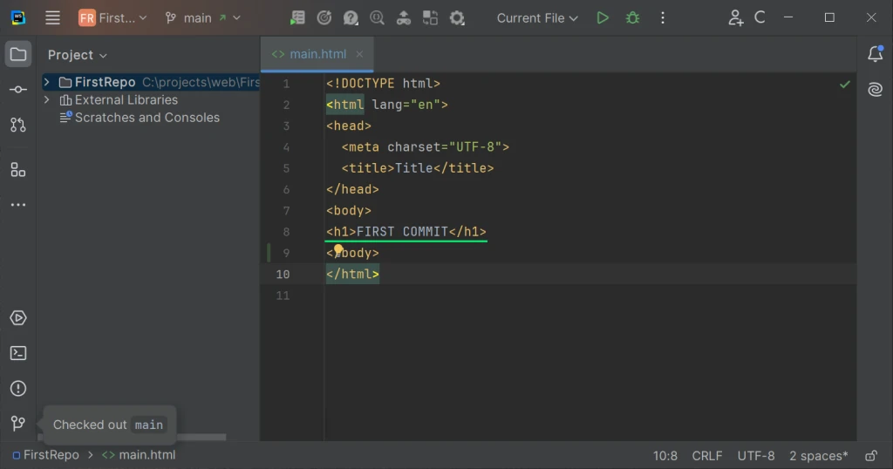

You should now see:

* The main branch
* The old code

---

# 11.4 Merging Branches

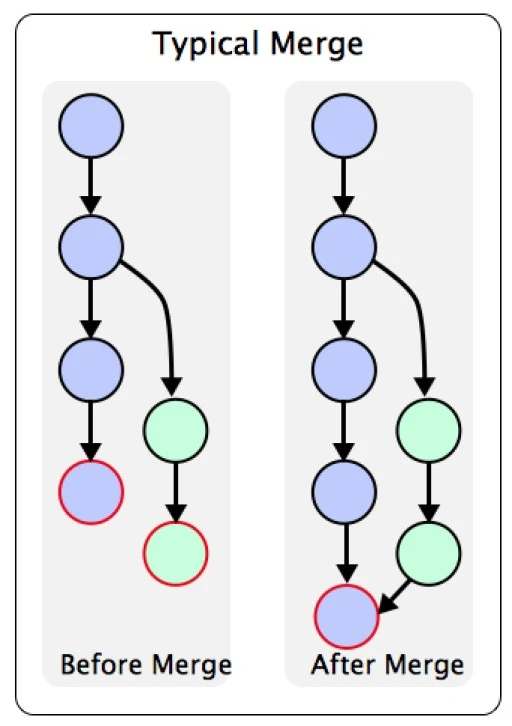

Alright, now let's try to merge the code from our two branches.

---

## Step 1

First, let's add another file to our project — **index.html** — and write some code in it.

Create the index.html file.
Write some code in it:

```html
<h1>Hello</h1>
```

Commit the file.

Now in the main branch, you should have:

* index.html
* main.html

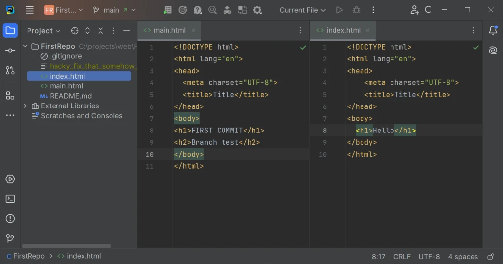

---

## Step 2: Merging Branches

We'll merge the changes made in the **test** branch into our current **main** branch.

To do this, use the top menu and select:

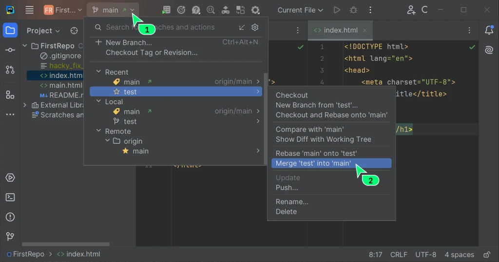

**Merge ‘test’ into ‘main’**

---

## Step 3: Check the Result

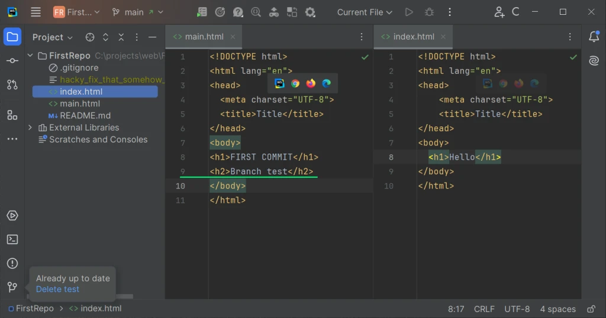

Let’s check:

* The branch **main** is still displayed at the top
* We have 2 files: index.html and main.html
* The file main.html contains code that was added in the test branch

---

# 11.5 Merge Conflicts

Sometimes, you might run into conflicts when merging branches.

If you make changes to the same file in different branches and then try to merge them, a conflict might occur.

---

## Text File Conflict

Git is super smart — it understands file types.

If you make changes in different parts of files that it considers text, it’ll just merge those changes into the right spots, like a human would.

---

## Binary File Conflict

But if you tweak something like an image or a document, Git won’t try to mash those parts together.

Instead, it’ll just ask you to pick which version of the file you want to keep in the current branch.

---

## Manually Resolving Conflicts

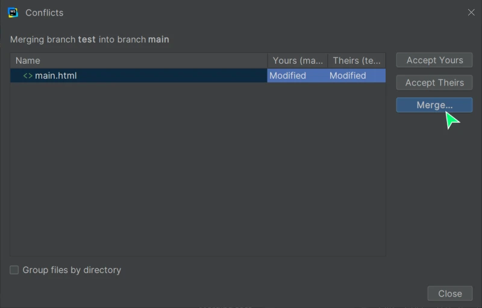

If you make changes to the same place in a text file, Git won’t be able to merge those versions correctly and will ask you to fix it yourself.

Here’s what that might look like:

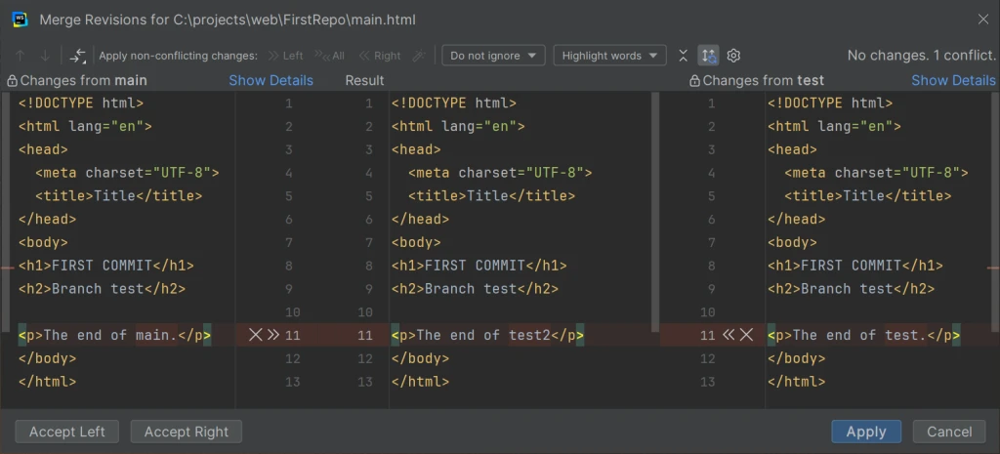

What you see here:

* On the left — the content of the main.html file from the main branch
* On the right — the content of the main.html file from the test branch
* In the middle — WebStorm offers you to write the final version of the code

You can click the >> and << buttons to automatically insert changes from a file.

You can accept one version or manually edit the code to combine both versions.

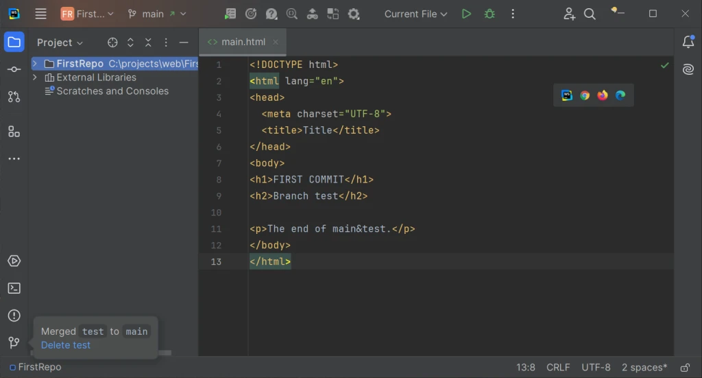

After resolving the conflict, save the file and commit the result.

---

# 11.6 Change History

Here's something cool and useful.

You can check out the change history of any file by clicking the **Show History** button.

There are two spots where you'll find it. Go ahead and locate them.

This is what the change history looks like for the file main.html.

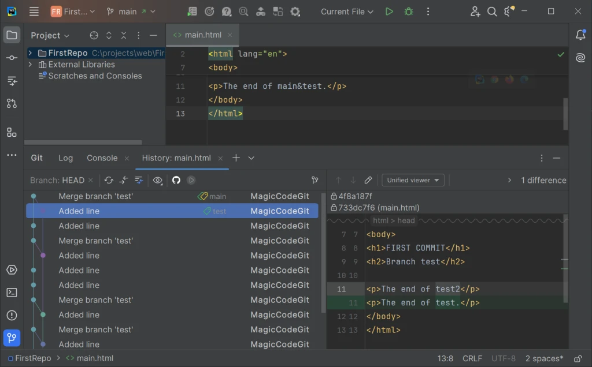

## Explanations

On the left, you can see the change history of a specific file:

* The newer the change, the higher it appears
* The older the change, the lower it is
* You'll also find the branch merge history here

On the right — the changes made in a specific commit.

---