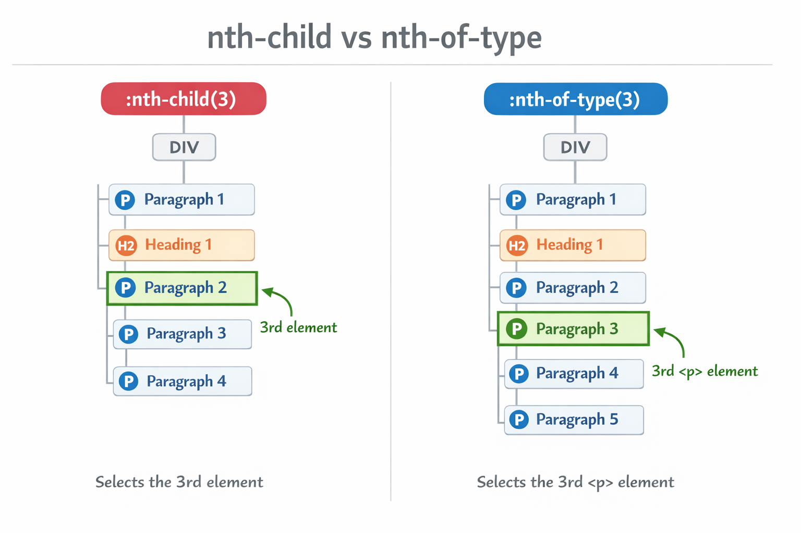

# Structural Pseudo-classes in CSS

Structural pseudo-classes allow you to **select elements based on their position within the document tree (DOM)**. Instead of adding extra classes or IDs in HTML, CSS can automatically target elements depending on **their order among siblings**.

This makes CSS **cleaner, more maintainable, and more powerful**, especially when styling lists, tables, grids, or repeated content such as cards and articles.

Common structural pseudo-classes include:

* `:first-child`
* `:last-child`
* `:nth-child()`
* `:nth-of-type()`

---

# 3.1 Pseudo-class `:first-child`

The `:first-child` pseudo-class selects **the first child element of its parent**.

It is useful when you want to apply special styling to the **first element in a group**, such as the first list item, paragraph, or card.

## Syntax

```css
selector:first-child {
  property: value;
}
```

## Example

### HTML

```html
<ul>
  <li>Apple</li>
  <li>Banana</li>
  <li>Mango</li>
</ul>

<div>
  <p>First paragraph</p>
  <p>Second paragraph</p>
</div>
```

### CSS

```css
/* Styling the first list item */
li:first-child {
  font-weight: bold;
  color: red;
}

/* Styling the first paragraph inside a div */
div p:first-child {
  text-transform: uppercase;
}
```

### Result

* The **first list item becomes bold and red**
* The **first paragraph inside the div becomes uppercase**

---

# 3.2 Pseudo-class `:last-child`

The `:last-child` pseudo-class selects **the last child element of its parent**.

This is commonly used for styling the **last element in a group**, such as removing borders or adjusting spacing.

## Syntax

```css
selector:last-child {
  property: value;
}
```

## Example

### HTML

```html
<ul>
  <li>Apple</li>
  <li>Banana</li>
  <li>Mango</li>
</ul>

<div>
  <p>First paragraph</p>
  <p>Second paragraph</p>
</div>
```

### CSS

```css
/* Styling the last list item */
li:last-child {
  font-style: italic;
  color: blue;
}

/* Styling the last paragraph inside a div */
div p:last-child {
  text-decoration: underline;
}
```

### Result

* The **last list item becomes italic and blue**
* The **last paragraph inside the div becomes underlined**

---

# 3.3 Pseudo-class `:nth-child()`

The `:nth-child()` pseudo-class selects elements **based on their position among siblings**.

It accepts an **argument** that determines which elements should be selected.

## Syntax

```css
selector:nth-child(argument) {
  property: value;
}
```

---

## Arguments

### 1. Number

Selects an element at a specific position.

Example:

```css
li:nth-child(3) {
  font-weight: bold;
  color: green;
}
```

This selects **the third list item**.

---

### 2. Keywords

You can use:

* `odd`
* `even`

Example:

```css
li:nth-child(odd) {
  background-color: #f0f0f0;
}
```

This styles **all odd list items**.

---

### 3. Expression `an + b`

This allows advanced selection patterns.

Formula:

```
an + b
```

Where:

* `a` = interval
* `n` = sequence counter
* `b` = starting position

Example:

```css
li:nth-child(2n+1) {
  background-color: #e0e0e0;
}
```

This selects:

```
1st, 3rd, 5th, 7th...
```

### Example

```css
/* Styling every second item starting from the first */
li:nth-child(2n+1) {
  background-color: #e0e0e0;
}
```

---

# 3.4 Pseudo-class `:nth-of-type()`

The `:nth-of-type()` pseudo-class works similarly to `:nth-child()`, but it **only counts elements of the same type**.

This is extremely useful when **different elements are mixed together**.

## Syntax

```css
selector:nth-of-type(argument) {
  property: value;
}
```

---

## Example 1: Selecting Even Paragraphs

### HTML

```html
<div>
  <p>Paragraph 1</p>
  <h2>Heading</h2>
  <p>Paragraph 2</p>
  <p>Paragraph 3</p>
  <p>Paragraph 4</p>
</div>
```

### CSS

```css
p:nth-of-type(even) {
  background-color: #d0d0d0;
}
```

### Result

Only the **even paragraphs** are styled.

```
Paragraph 2
Paragraph 4
```

---

## Example 2: Selecting Elements at a Specific Position

```css
h2:nth-of-type(2) {
  font-size: 2em;
  color: orange;
}
```

This styles the **second `h2` element**.

---

## Example 3: Using Expressions

```css
li:nth-of-type(3n+2) {
  background-color: #c0c0c0;
}
```

This selects:

```
2nd, 5th, 8th, 11th...
```

---

# Difference Between `:nth-child()` and `:nth-of-type()`

Example HTML:

```html
<div>
  <p>Paragraph 1</p>
  <h2>Heading</h2>
  <p>Paragraph 2</p>
  <p>Paragraph 3</p>
</div>
```

### Using `:nth-child()`

```css
p:nth-child(2)
```

❌ This **won't work** because the second child is an `h2`.

---

### Using `:nth-of-type()`

```css
p:nth-of-type(2)
```

✅ This selects **Paragraph 2**.

# Comparing nth-child and nth-of-type



The **difference between `:nth-child()` and `:nth-of-type()`** comes from **what the browser counts when determining the position of an element**.

In simple terms:

* `:nth-child()` counts **all elements** among the parent’s children.
* `:nth-of-type()` counts **only elements of the same type (same tag)**.

This difference becomes important when **different HTML tags are mixed together**.

---

# Example Structure

Consider this HTML:

```html
<div>
    <p>Paragraph 1</p>
    <h2>Heading</h2>
    <p>Paragraph 2</p>
    <p>Paragraph 3</p>
    <p>Paragraph 4</p>
</div>
```

The browser sees the children like this:

| Position | Element           |
| -------- | ----------------- |
| 1        | `<p>` Paragraph 1 |
| 2        | `<h2>` Heading    |
| 3        | `<p>` Paragraph 2 |
| 4        | `<p>` Paragraph 3 |
| 5        | `<p>` Paragraph 4 |

---

# Using `:nth-child()`

CSS:

```css
p:nth-child(3) {
    color: green;
}
```

Meaning:

> Select `<p>` elements that are the **3rd child of their parent**.

The 3rd child is:

```
<p>Paragraph 2</p>
```

So **Paragraph 2 becomes green**.

Important: the browser counted **every element**, including the `<h2>`.

---

# Using `:nth-of-type()`

CSS:

```css
p:nth-of-type(3) {
    color: green;
}
```

Meaning:

> Select the **3rd `<p>` element**.

Now the browser **ignores the `<h2>`** and only counts `<p>` elements.

Counting only `<p>`:

| p number | Element     |
| -------- | ----------- |
| 1        | Paragraph 1 |
| 2        | Paragraph 2 |
| 3        | Paragraph 3 |
| 4        | Paragraph 4 |

So:

```
<p>Paragraph 3</p>
```

becomes **green**.

---

# Visual Comparison

DOM order:

```
1  p   Paragraph 1
2  h2  Heading
3  p   Paragraph 2
4  p   Paragraph 3
5  p   Paragraph 4
```

Result:

| Selector           | Styled Element |
| ------------------ | -------------- |
| `p:nth-child(3)`   | Paragraph 2    |
| `p:nth-of-type(3)` | Paragraph 3    |

---

# Simple Rule to Remember

Developers often remember it like this:

```
nth-child → counts everything
nth-of-type → counts only the same element type
```

---

# When Each Is Useful

Use **`:nth-child()`** when:

* You want styling based on **exact position in the layout**
* Example: grid columns, card layouts, table rows

Example:

```css
.card:nth-child(3) {
    border: 2px solid red;
}
```

---

Use **`:nth-of-type()`** when:

* Different HTML elements are mixed
* You only want to target **one type of element**

Example:

```css
p:nth-of-type(2) {
    font-weight: bold;
}
```

---

✅ **Summary**

| Selector         | Counts                         |
| ---------------- | ------------------------------ |
| `:nth-child()`   | All child elements             |
| `:nth-of-type()` | Only elements of the same type |

---


# Exercise 1: Style Even Elements

## Task

In the container `.grid`, style all **even list items** so that they have a **light gray background**.

### Requirements

* Use `:nth-child(even)`
* Apply styles only inside `.grid`
* Background color: `#d3d3d3`

---

## HTML

```html
<ul class="grid">
  <li>Item 1</li>
  <li>Item 2</li>
  <li>Item 3</li>
  <li>Item 4</li>
  <li>Item 5</li>
  <li>Item 6</li>
</ul>
```

---

## Solution

```css
.grid li:nth-child(even) {
  background-color: #d3d3d3;
}
```

---

## Result

Styled items:

```
Item 2
Item 4
Item 6
```

---

# Exercise 2: Style Every 3rd Paragraph

## Task

Inside a container `.articles`, style **every third paragraph starting from the first**.

Use:

```
:nth-of-type(3n+1)
```

Background color: **light yellow**

---

## HTML

```html
<div class="articles">
  <p>Article paragraph 1</p>
  <p>Article paragraph 2</p>
  <p>Article paragraph 3</p>
  <p>Article paragraph 4</p>
  <p>Article paragraph 5</p>
  <p>Article paragraph 6</p>
</div>
```

---

## Solution

```css
.articles p:nth-of-type(3n+1) {
  background-color: lightyellow;
}
```

---

## Result

Styled paragraphs:

```
Paragraph 1
Paragraph 4
Paragraph 7
```

---

# Key Takeaways

Structural pseudo-classes allow CSS to style elements **based on position in the DOM** without adding extra classes.

Important pseudo-classes:

| Pseudo-class     | Description                                 |
| ---------------- | ------------------------------------------- |
| `:first-child`   | Selects the first child element             |
| `:last-child`    | Selects the last child element              |
| `:nth-child()`   | Selects elements based on position          |
| `:nth-of-type()` | Selects elements based on type and position |

### Example patterns

```css
li:first-child
li:last-child
li:nth-child(odd)
li:nth-child(2n+1)
p:nth-of-type(even)
```

These selectors are extremely useful for:

* alternating row colors (zebra striping)
* responsive grid layouts
* article layouts
* card UI components

---

