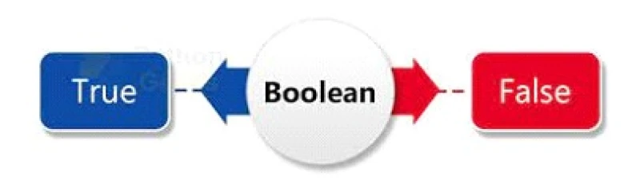

---

# 📘 7. Logical Operators in JavaScript

Logical operators are used to **perform operations on boolean values (`true` or `false`)**. They are essential for controlling program flow in conditions like `if`, `else`, and loops.

---

# 🧠 7.1 Boolean Algebra

In JavaScript, the **Boolean** data type represents:

```javascript
true
false
```



## ✅ Why It’s Important

* Used in **decision making**
* Controls execution of code blocks
* Works with **logical and comparison operators**

---

# 🔗 7.2 Logical AND (`&&`)

The **AND operator (`&&`)** returns `true` **only if both conditions are true**.

## ✅ Syntax

```javascript
a && b
```

## ✅ Example

```javascript
let a = true;
let b = false;

console.log(a && b); // false
```

## 🧠 Truth Table

| a     | b     | a && b |
| ----- | ----- | ------ |
| true  | true  | true   |
| true  | false | false  |
| false | true  | false  |
| false | false | false  |

---

## 🎯 Usage Example

```javascript
let age = 25;
let hasLicense = true;

if (age >= 18 && hasLicense) {
  console.log("You can drive.");
}
```

✔ Both conditions must be true

---

# 🔗 7.3 Logical OR (`||`)

The **OR operator (`||`)** returns `true` if **at least one condition is true**.

## ✅ Syntax

```javascript
a || b
```

## ✅ Example

```javascript
let a = true;
let b = false;

console.log(a || b); // true
```

## 🧠 Truth Table

| a    | b    | a \|\| b |
|------|------|----------|
| true | true | true     |
| true | false| true     |
| false| true | true     |
| false| false| false    |

---

## 🎯 Usage Example

```javascript
let isWeekend = true;
let isHoliday = false;

if (isWeekend || isHoliday) {
  console.log("Today is a day off.");
}
```

✔ Only one condition needs to be true

---

# 🔄 7.4 Logical NOT (`!`)

The **NOT operator (`!`)** reverses a boolean value.

## ✅ Syntax

```javascript
!a
```

## ✅ Example

```javascript
let a = true;
console.log(!a); // false
```

## 🧠 Truth Table

| a     | !a    |
| ----- | ----- |
| true  | false |
| false | true  |

---

## 🎯 Usage Example

```javascript
let isRaining = false;

if (!isRaining) {
  console.log("You can go for a walk.");
}
```

✔ Used for **negative conditions**

---

# ⚖️ 7.5 Comparison Operators

Comparison operators return **boolean values**, often used with logical operators.

---

## 📊 Operators Table

| Operator | Description      | Example     | Result |
| -------- | ---------------- | ----------- | ------ |
| `==`     | Equal (loose)    | `5 == '5'`  | true   |
| `===`    | Strict equal     | `5 === '5'` | false  |
| `!=`     | Not equal        | `5 != '5'`  | false  |
| `!==`    | Strict not equal | `5 !== '5'` | true   |
| `>`      | Greater than     | `10 > 5`    | true   |
| `<`      | Less than        | `10 < 5`    | false  |
| `>=`     | Greater or equal | `10 >= 10`  | true   |
| `<=`     | Less or equal    | `10 <= 5`   | false  |

---

## 🔍 Examples

### ✅ `==` vs `===`

```javascript
console.log(5 == '5');   // true
console.log(5 === '5');  // false
```

✔ `==` → type conversion

✔ `===` → strict comparison

---

### ✅ `!=` vs `!==`

```javascript
console.log(5 != '5');   // false
console.log(5 !== '5');  // true
```

---

### ✅ Other Operators

```javascript
console.log(10 > 5);    // true
console.log(10 < 5);    // false
console.log(10 >= 10);  // true
console.log(10 <= 5);   // false
```

---

# 🧪 Exercises with Solutions

---

## 📝 Exercise 1: Right to Drive

### ✅ Problem

Check if a user can drive:

* Age ≥ 18
* Has a license

---

### ✅ Solution

```javascript
let age = 20; // example input
let hasLicense = true;

if (age >= 18 && hasLicense) {
  console.log("You can drive a car");
} else {
  console.log("You cannot drive a car");
}
```

---

## 📝 Exercise 2: Weekend Check

### ✅ Problem

Check if today is:

* Weekend OR holiday

---

### ✅ Solution

```javascript
let isWeekend = true;  // example input
let isHoliday = false;

if (isWeekend || isHoliday) {
  console.log("Today is a day off");
} else {
  console.log("Today is a working day");
}
```

---

# 🧠 Bonus: Combining Operators

You can combine multiple logical operators:

```javascript
let age = 20;
let hasLicense = true;
let hasCar = false;

if ((age >= 18 && hasLicense) || hasCar) {
  console.log("You can travel");
}
```

---

# ⚠️ Common Mistakes

---

## ❌ Using `==` instead of `===`

```javascript
5 == "5"   // true (can cause bugs)
```

✔ Prefer:

```javascript
5 === "5"  // false
```

---

## ❌ Forgetting NOT behavior

```javascript
let value = false;
if (!value) {
  console.log("Runs");
}
```

✔ `!false → true`

---

# 🎯 Key Takeaways

* `&&` → all conditions must be true
* `||` → at least one must be true
* `!` → reverses the value
* Comparison operators return **boolean values**
* Prefer `===` over `==`
* Logical operators are used heavily in **conditions and loops**

---

# ⚡ 8. Short-Circuit Evaluation

JavaScript logical operators **don’t always evaluate both sides**.
They stop early when the result is already known.

---

## 🔹 8.1 AND (`&&`) Short-Circuit

👉 Returns the **first falsy value**, or the **last value if all are true**

## ✅ Example

```javascript
console.log(true && false); // false
```

---

## 🔍 Advanced Behavior

```javascript
console.log(5 && 10); // 10
```

### 🧠 Why?

* `5` → truthy → move to next
* `10` → returned

---

## ❌ Stops Early

```javascript
console.log(0 && 10); // 0
```

✔ `0` is falsy → returned immediately

👉 Second value is **never checked**

---

## 📌 Rule for `&&`

```text
Returns FIRST falsy OR LAST truthy value
```

---

## 🔹 8.2 OR (`||`) Short-Circuit

👉 Returns the **first truthy value**, or the **last value if all are false**

---

## ✅ Example

```javascript
console.log(false || true); // true
```

---

## 🔍 Advanced Behavior

```javascript
console.log(0 || 10); // 10
```

✔ `0` is falsy → move to next

✔ `10` is truthy → returned

---

## ❌ Stops Early

```javascript
console.log(5 || 10); // 5
```

✔ `5` is truthy → returned immediately

---

## 📌 Rule for `||`

```text
Returns FIRST truthy OR LAST falsy value
```

---

## 🔹 8.3 NOT (`!`) and Double NOT (`!!`)

```javascript
console.log(!true);  // false
console.log(!0);     // true
```

---

## 🔥 Convert to Boolean

```javascript
console.log(!!"hello"); // true
console.log(!!0);       // false
```

✔ `!!` is a common trick to **force boolean conversion**

---

# 🎯 Real-World Uses

---

## ✅ Default Values

```javascript
let name = "" || "Guest";
console.log(name); // Guest
```

---

## ✅ Safe Function Calls

```javascript
let user = null;

user && console.log(user.name); // no error
```

---

## ✅ Conditional Execution

```javascript
true && console.log("Runs");
```

---

# 😈 9. Tricky Logical Questions

---

## 🧩 Trick 1: Output?

```javascript
console.log(0 || "Hello" && "World");
```

---

### 🧠 Step-by-Step

```text
"Hello" && "World" → "World"
0 || "World" → "World"
```

---

### ✅ Answer

```text
World
```

---

## 🧩 Trick 2: Output?

```javascript
console.log(false || 0 || null || "JS");
```

---

### 🧠 Evaluation

* false → skip
* 0 → skip
* null → skip
* "JS" → truthy

---

### ✅ Answer

```text
JS
```

---

## 🧩 Trick 3: Output?

```javascript
console.log(true && false || true);
```

---

### 🧠 Operator Precedence

* `&&` runs first

```text
true && false → false
false || true → true
```

---

### ✅ Answer

```text
true
```

---

## 🧩 Trick 4: Output?

```javascript
console.log(5 && 0 || 10);
```

---

### 🧠 Step-by-Step

```text
5 && 0 → 0
0 || 10 → 10
```

---

### ✅ Answer

```text
10
```

---

## 🧩 Trick 5: Output?

```javascript
console.log(!"");
```

---

### 🧠 Explanation

* `""` is falsy
* `!"" → true`

---

### ✅ Answer

```text
true
```

---

## 🧩 Trick 6: Output?

```javascript
console.log(!!"0");
```

---

### 🧠 Explanation

* `"0"` is a string → truthy
* `!!` converts to boolean

---

### ✅ Answer

```text
true
```

---

## 🧩 Trick 7: Output?

```javascript
let x = null;
let y = x || "default";
console.log(y);
```

---

### ✅ Answer

```text
default
```

---

# ⚠️ Important Concepts

---

## 🔥 Truthy vs Falsy Values

### ❌ Falsy Values

```javascript
false
0
""
null
undefined
NaN
```

### ✅ Everything else is truthy

---

## 🔥 Operator Precedence

```text
!  → highest
&& → middle
|| → lowest
```

---

# 🧪 Final Practice Exercises

---

## 📝 Exercise 1

```javascript
console.log(0 && "A" || "B");
```

### ✅ Answer

```text
B
```

---

## 📝 Exercise 2

```javascript
console.log("Hello" && "" || "World");
```

### ✅ Answer

```text
World
```

---

## 📝 Exercise 3

```javascript
let isLoggedIn = false;
isLoggedIn && console.log("Welcome!");
```

### ❓ Output?

### ✅ Answer

👉 Nothing prints

✔ Because condition is false

---

# 🎯 Final Takeaways

* `&&` → returns first falsy or last truthy
* `||` → returns first truthy or last falsy
* `!!` → converts to boolean
* JavaScript uses **short-circuit evaluation**
* Operator precedence matters: `! > && > ||`
* Logical operators return **values, not just true/false**

---

# ⚙️ 10. Bitwise Operators in JavaScript

Bitwise operators work on **binary (0s and 1s)** instead of normal numbers.

---

## 🧠 10.1 What Happens Internally?

```javascript
5 → 00000101
3 → 00000011
```

Operations are done **bit by bit**.

---

# 🔗 10.2 Bitwise AND (`&`)

Returns `1` only if both bits are `1`.

## ✅ Example

```javascript
console.log(5 & 3);
```

### 🧠 Binary

```text
  0101 (5)
& 0011 (3)
-------
  0001 → 1
```

✔ Output:

```javascript
1
```

---

# 🔗 10.3 Bitwise OR (`|`)

Returns `1` if **at least one bit is 1**

## ✅ Example

```javascript
console.log(5 | 3);
```

### 🧠 Binary

```text
  0101
| 0011
-------
  0111 → 7
```

✔ Output:

```javascript
7
```

---

# 🔗 10.4 Bitwise XOR (`^`)

Returns `1` if bits are **different**

## ✅ Example

```javascript
console.log(5 ^ 3);
```

### 🧠 Binary

```text
  0101
^ 0011
-------
  0110 → 6
```

---

# 🔄 10.5 Bitwise NOT (`~`)

Flips all bits.

## ✅ Example

```javascript
console.log(~5);
```

### 🧠 Result

```text
~5 = -6
```

✔ Because of **two’s complement representation**

---

# 🔀 10.6 Left Shift (`<<`)

Shifts bits to the left (multiply by 2)

```javascript
console.log(5 << 1); // 10
```

---

# 🔀 10.7 Right Shift (`>>`)

Shifts bits to the right (divide by 2)

```javascript
console.log(5 >> 1); // 2
```

---

# 🎯 When Bitwise is Used

* Performance optimization
* Flags and permissions
* Low-level programming
* Competitive programming

---

# 💻 11. Real-World Loop + Logical Problems

---

## 🧩 Problem 1: FizzBuzz (Classic Interview)

### ❓ Rules

* If divisible by 3 → "Fizz"
* If divisible by 5 → "Buzz"
* If both → "FizzBuzz"

---

### ✅ Solution

```javascript
for (let i = 1; i <= 15; i++) {
  if (i % 3 === 0 && i % 5 === 0) {
    console.log("FizzBuzz");
  } else if (i % 3 === 0) {
    console.log("Fizz");
  } else if (i % 5 === 0) {
    console.log("Buzz");
  } else {
    console.log(i);
  }
}
```

---

# 🧩 Problem 2: Find Largest Number in Array

```javascript
let arr = [5, 9, 2, 15, 3];
let max = arr[0];

for (let i = 1; i < arr.length; i++) {
  if (arr[i] > max) {
    max = arr[i];
  }
}

console.log(max);
```

✔ Output:

```text
15
```

---

# 🧩 Problem 3: Count Even and Odd Numbers

```javascript
let arr = [1, 2, 3, 4, 5, 6];
let even = 0, odd = 0;

for (let num of arr) {
  if (num % 2 === 0) {
    even++;
  } else {
    odd++;
  }
}

console.log("Even:", even);
console.log("Odd:", odd);
```

---

# 🧩 Problem 4: Remove Duplicates

```javascript
let arr = [1, 2, 2, 3, 4, 4];
let unique = [];

for (let num of arr) {
  if (!unique.includes(num)) {
    unique.push(num);
  }
}

console.log(unique);
```

---

# 🧩 Problem 5: Palindrome Check

```javascript
let str = "madam";
let reversed = "";

for (let i = str.length - 1; i >= 0; i--) {
  reversed += str[i];
}

if (str === reversed) {
  console.log("Palindrome");
} else {
  console.log("Not Palindrome");
}
```

---

# 🧩 Problem 6: Sum of Even Numbers Only

```javascript
let sum = 0;

for (let i = 1; i <= 10; i++) {
  if (i % 2 === 0) {
    sum += i;
  }
}

console.log(sum);
```

---

# 🧩 Problem 7: Find First Duplicate

```javascript
let arr = [1, 3, 4, 2, 3, 5];
let seen = [];

for (let num of arr) {
  if (seen.includes(num)) {
    console.log("First duplicate:", num);
    break;
  }
  seen.push(num);
}
```

---

# 🔥 Pro Tips (Interview Gold)

---

## 💡 1. Combine Logic + Loops

Most problems are:

```text
Loop → Condition → Action
```

---

## 💡 2. Watch Complexity

* Nested loops → O(n²)
* Use sets/maps to optimize

---

## 💡 3. Use Short-Circuiting Smartly

```javascript
isLoggedIn && showDashboard();
```

---

## 💡 4. Use Bitwise Tricks (Advanced)

### Check Even Number

```javascript
if ((num & 1) === 0) {
  console.log("Even");
}
```

---

# 🎯 Final Challenge (Advanced)

### 🧩 Problem:

Print numbers 1–30:

* "Fizz" if divisible by 3
* "Buzz" if divisible by 5
* Skip multiples of 7
* Stop at 25

---

### ✅ Solution

```javascript
for (let i = 1; i <= 30; i++) {
  if (i === 25) break;

  if (i % 7 === 0) continue;

  if (i % 3 === 0 && i % 5 === 0) {
    console.log("FizzBuzz");
  } else if (i % 3 === 0) {
    console.log("Fizz");
  } else if (i % 5 === 0) {
    console.log("Buzz");
  } else {
    console.log(i);
  }
}
```

---


