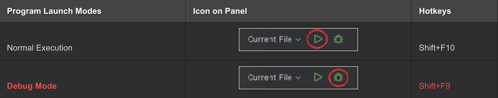
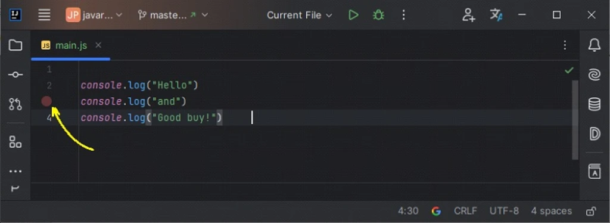
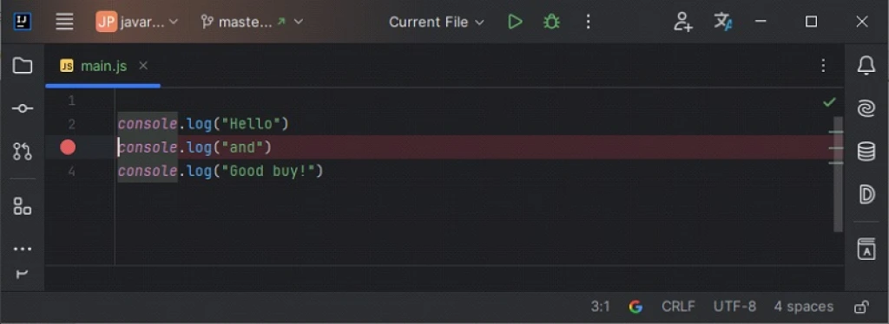
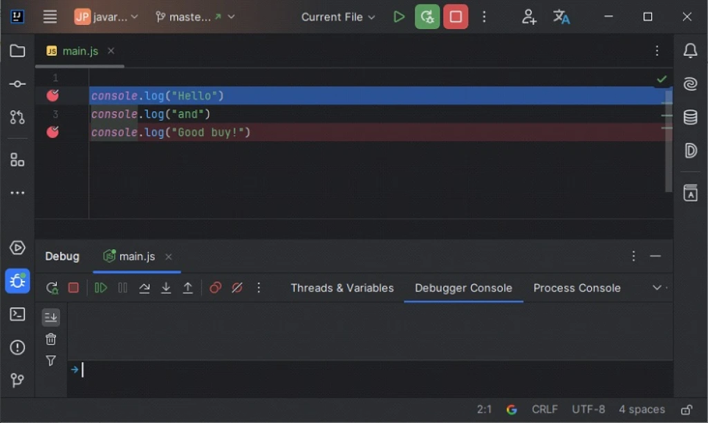
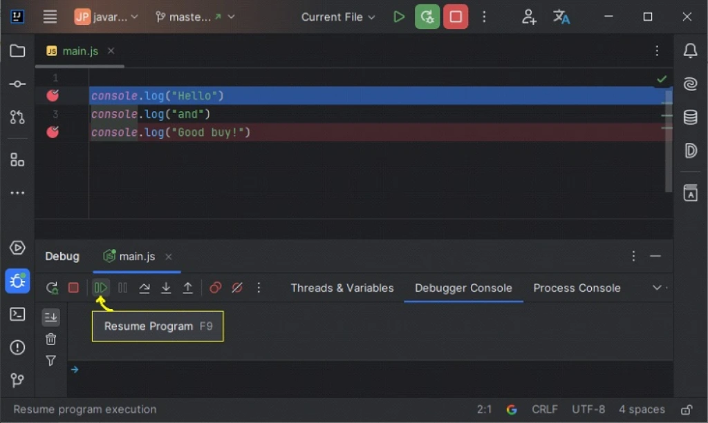
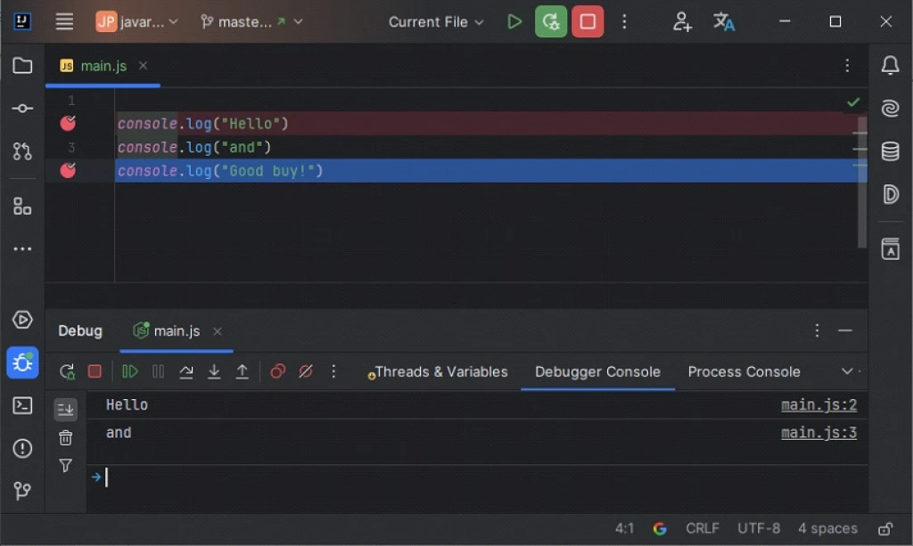
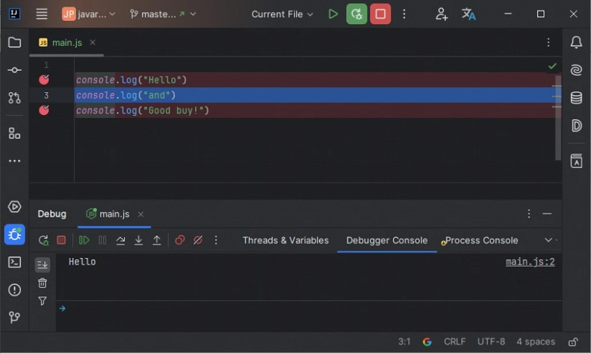
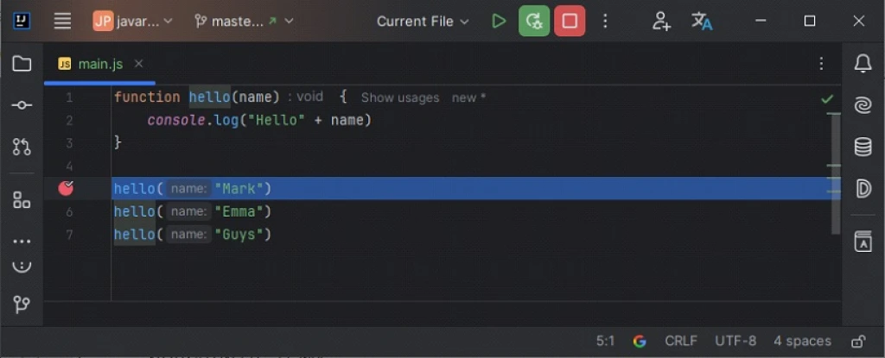
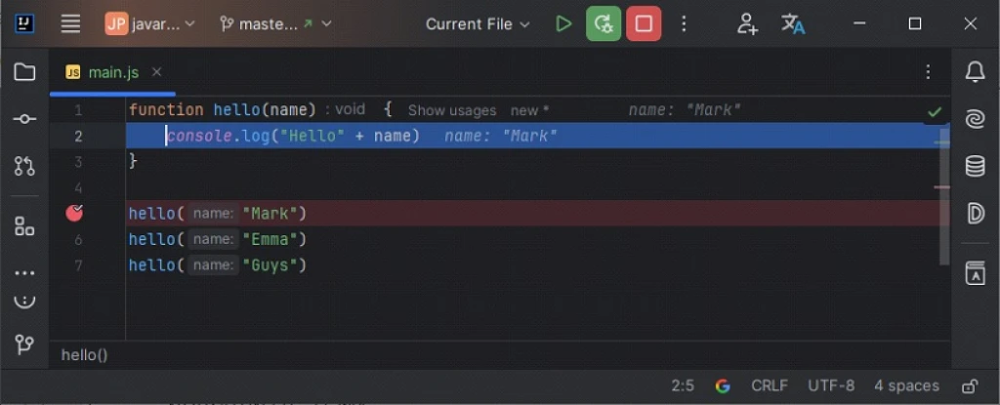

# 10.1 Starting the Debugger

We're gonna learn about debugging using IntelliJ IDEA, which is both logical and delightful. You'll see why soon enough.

In IntelliJ IDEA (you'll need the Ultimate Edition), you can run your program in two modes:

You're already familiar with the normal mode: the program runs, does its thing, and finishes. But debug mode has quite a few surprises for you.

>Debug Mode

Debug mode lets you run your entire program step-by-step. Or to be more precise, line-by-line. You can watch the values of variables at each step of the program (after executing each line of code). And you can even change them!

To get the basics of debugging a program down, you need to learn three things:

* Breakpoints
* Stepping Over
* Viewing Variable Values

---

# 10.2 Breakpoints

The IDE lets you place special markers in the code — breakpoints. Whenever the program, running in debug mode, reaches a line marked with a breakpoint, it will pause.

To set a breakpoint on a specific line, just click in IntelliJ IDEA to the left of that line. Example:

As a result, the line will be marked with a breakpoint, and IntelliJ IDEA will highlight the entire line in red:

Clicking again on the panel to the left of the code will remove the set breakpoint.

You can also simply set a breakpoint on the current line using the hotkey combination — **Ctrl+F8**. Pressing **Ctrl+F8** again on a line where there's already a breakpoint will remove it.

---

# 10.3 Running a Program in Debug Mode

If there's at least one breakpoint in your program, you can run it in debug mode (Shift+F9 or the "bug icon").

After launching in debug mode, the program runs as usual. But as soon as it reaches a line of code marked with a breakpoint, it'll pause. Example:

In the upper half of the screenshot, you see the program code with two breakpoints. The program is paused on line 2 — marked with a blue line. Line 2 hasn't executed yet: nothing has been printed to the console.

The lower half of the screen shows the debug mode panels: the Thread & variables panel, the Console (screen output) panel, and a set of buttons for debug mode.

You can take your program off pause (resume its execution) by pressing the Resume Program button on the bottom left panel (or by pressing the F9 key).

If you press that button (or **F9**), the program will continue running until it hits the next breakpoint or finishes. Here's what you'll see after pressing that button:

The program stopped at the second breakpoint, and the console shows "Hello" and "and" — indicating that out of three lines of output to the screen, only two executed.

---

# 10.4 Stepping Over

If your program is running in debug mode, you can also step through it: one step — one line. There are two hotkeys for stepping: F7 and F8 — each one executes the current line of code. But first, you need to pause your program using a breakpoint.

If you want to execute your program line-by-line, you need to set a breakpoint right at the start — on the first line of code and run it in debug mode.

When the program pauses, you can start stepping through it line-by-line. One press of the F8 key — one line.

Here's what our program will look like after stopping and pressing the F8 key once:

The first line — print(“Hello”) has already executed, and the current line is the second one. You can also see in the lower part of the screenshot that the word "Hello" has already been printed to the screen.

---

# 10.5 Stepping Into Functions

If your program has its own functions, and you want the debug mode to not just step through, but also step into your functions, then for "stepping into a function" you need to press the F7 key instead of F8.

Suppose you're stepping through the program and have currently paused at line 5. If you press F8, IntelliJ IDEA will simply execute the fifth line and move to the sixth:

But if you press F7, IntelliJ IDEA will step into and execute the function hello() line-by-line:

It's pretty simple. If what's happening inside the method isn't too important, you press F8. If it is, press F7 to step through all its code.

---