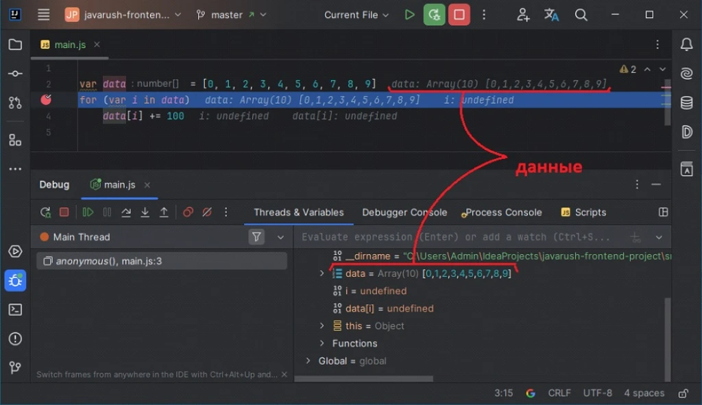
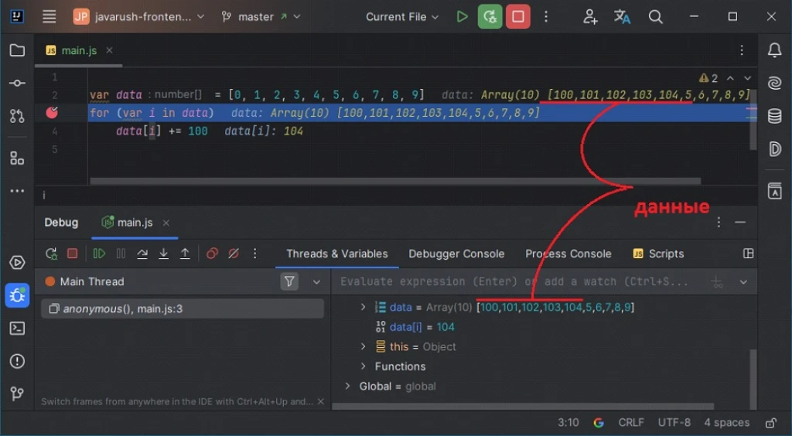
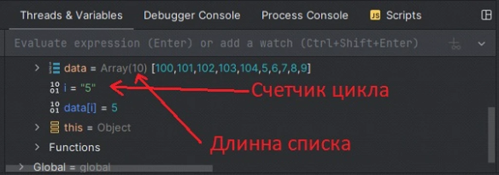
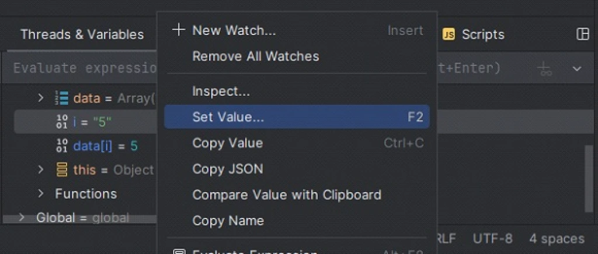
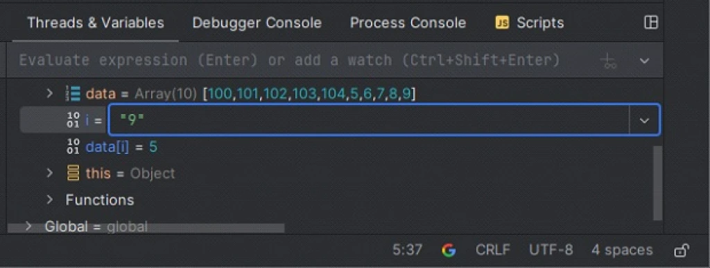
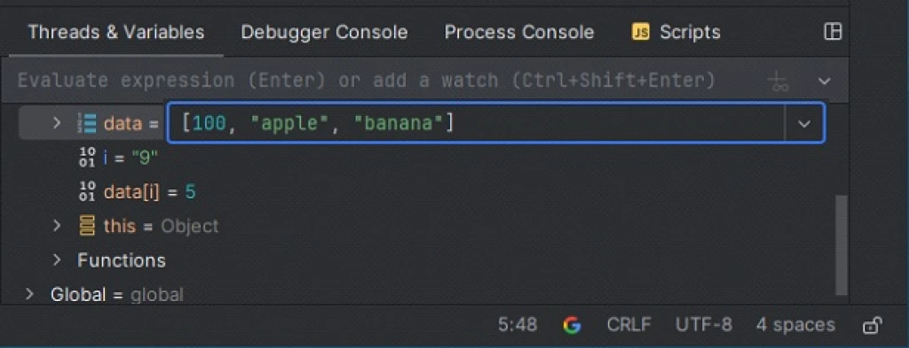
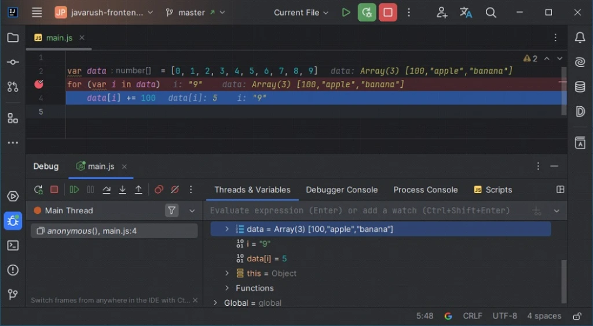
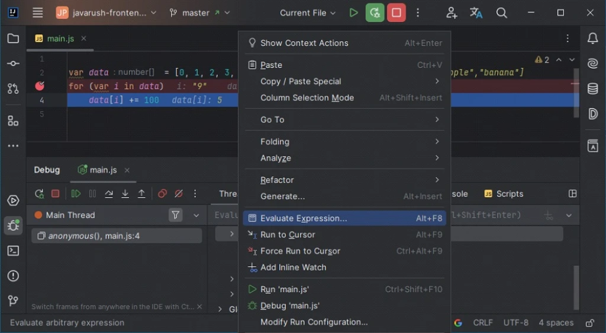
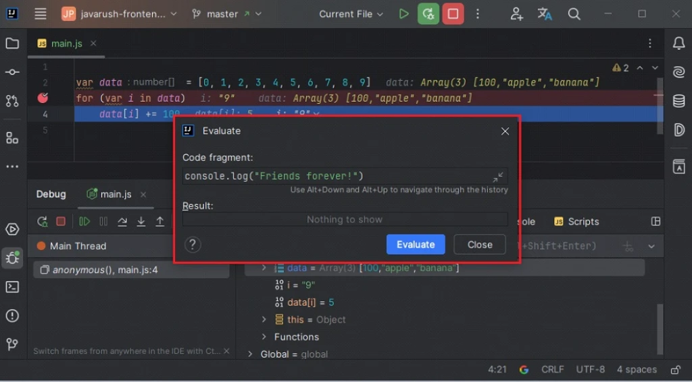

# 11.1 Threads & Variables

When you pause a program using a break point or while stepping through, you can always check the values of variables that are known at the current point in the program.

Let's write a program that fills an array of 10 elements with numbers from 100 to 109:

The smart system IntelliJ IDEA shows the values of important variables right above the code. In our case, it's the list variable data.

Also, at the bottom of the screenshot, we have the Threads & Variables tab open (not Debug Console), and it displays all known variables (with their values) at this point in the program.

If you press F8 ten times, you'll complete 5 iterations of the loop (one press for the loop header and one for the loop body). Then you'll get this result:

It completed 5 out of 10 loop iterations, and you can see that the data array already has 5 values: 100, 101, 102, 103, and 104.

By the way, if you check out the variables panel, you can see even more useful variables there:

---

# 11.2 Changing Variable Values

By the way, if you want to test how your program behaves with certain variable values, you can just change the values of any variables right during the program's execution (in debug mode).

To do this, right-click on the variable name or press F2:

Then you just type in a new variable value and press Enter—done:

Or even like this:

Press Enter and that's it—now the program uses the new value for your variable.

---

# 11.3 Executing Code Snippets

At any point during program execution, you can execute arbitrary code. This is done using the Alt+F8 (Option+F8) shortcut or a context menu item:

A special window will appear where you can write any code, and you can use variables known at the current point in the program there!

You can call any methods: say, make the program output some text to the screen without interrupting its operation! Example:

You just learned about maybe 5% of all the features of IntelliJ IDEA. Once you master these, we'll talk about the rest.

---