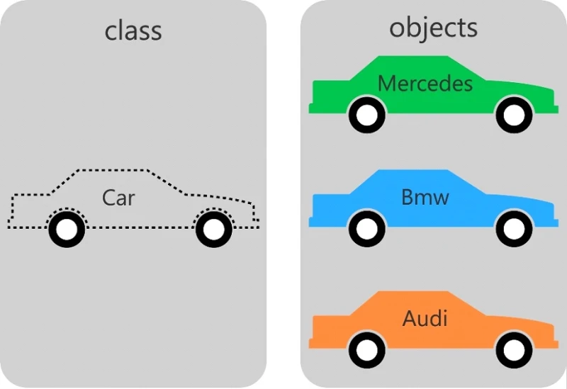

# **Everything is Objects in JavaScript**

---

## **1.1 Objects and Classes**

### **What Does “Everything is an Object” Mean?**

In JavaScript, almost everything is treated as an **object**:

* Numbers → objects
* Strings → objects
* Functions → objects
* Arrays → objects
* Even classes → special kinds of objects

This means JavaScript programs are built around **objects interacting with each other**.

---

### **Classes and Objects (Blueprint Analogy)**

A **class** is like a **blueprint**, and an **object** is the actual thing built from that blueprint.

 

#### Example Analogy:

* Blueprint → Class
* Ship → Object
* Many ships → Many objects from one class

### **JavaScript Example**

```javascript
class Ship {
  constructor(name, cargo) {
    this.name = name;
    this.cargo = cargo;
  }

  sail() {
    console.log(this.name + " is sailing with " + this.cargo);
  }
}

// Creating objects
const ship1 = new Ship("Titanic", "Passengers");
const ship2 = new Ship("CargoMaster", "Goods");

// Using objects
ship1.sail();
ship2.sail();
```

✅ **Explanation:**

* `Ship` → class (blueprint)
* `ship1`, `ship2` → objects
* Each object has its own data but same structure

---

### **Ant Colony Analogy (Object Interaction)**

Think of a program like an **ant colony**:

* Classes → types of ants (queen, worker, warrior)
* Objects → individual ants
* Objects interact with each other

💡 In JavaScript:

* Objects **call methods**
* Objects **pass data**
* Objects **work together to perform tasks**

---

### **Objects Interacting Example**

```javascript
class WorkerAnt {
  work() {
    console.log("Worker ant is collecting food");
  }
}

class QueenAnt {
  command(worker) {
    worker.work();
  }
}

const worker = new WorkerAnt();
const queen = new QueenAnt();

queen.command(worker);
```

✅ Objects interact by calling each other’s methods.

---

### **Using Existing Classes (Built-in Example)**

```javascript
const fs = require('fs');

// Open files
const src = fs.createReadStream('source.txt');
const dst = fs.createWriteStream('destination.txt');

// Copy contents
src.pipe(dst);

// Close files
src.on('end', () => {
  src.close();
  dst.close();
});
```

### **Key Idea**

You don’t need to know how everything works internally.
You only need to know:

* What the class does
* What its methods do
* What data to pass

This is called **abstraction**.

---

## **1.2 Program Design**

Designing a program is both:

* **Simple** → no strict rules
* **Complex** → many possible solutions

---

### **Key Principle: Write Code for Humans**

✔ Code must be:

* Readable
* Understandable
* Maintainable

❌ Bad practice:

* Complex but unreadable code

---

### **1. Write Clear Code**

Good JavaScript code often reads like English:

```javascript
if (a < b) {
  return a;
} else {
  return b;
}
```

Or shorter:

```javascript
return a < b ? a : b;
```

---

### **Best Practices**

* Keep methods **20–30 lines max**
* Use meaningful names
* Write simple logic

---

### **2. Choose the Right Entities**

Your program should reflect real-world or logical entities.

Example:
Instead of:

```javascript
// Bad design
class DataManager {}
```

Use:

```javascript
class User {}
class Product {}
class Order {}
```

✔ Clear and understandable

---

### **3. Break Program into Parts**

Programs should be modular.

#### Example:

* Keyboard, monitor, CPU → separate parts
* Each part has a specific role

---

### **Monolithic vs Modular**

| Type       | Description                  |
| ---------- | ---------------------------- |
| Modular    | Independent parts            |
| Monolithic | Everything tightly connected |

✔ Prefer **modular design**

---

## **1.3 Creating Your Own Classes**

### **Start with Entities**

When designing a program:

1. List all entities
2. Turn each entity into a class

---

### **Example: Chess Game**

Entities:

* Chessboard
* Pawn
* King
* Queen
* Bishop
* Knight
* Rook

---

### **Chessboard Example**

```javascript
class ChessBoard {
  constructor() {
    this.board = Array(8).fill(null).map(() => Array(8).fill(null));
  }

  isEmpty(x, y) {
    return this.board[x][y] === null;
  }
}
```

---

### **Piece Example**

```javascript
class Pawn {
  move() {
    console.log("Pawn moves forward");
  }
}
```

---

### **Key Rule**

> Each entity = one class

---

## **Exercises**

---

### **Exercise 1: Create a Class**

Create a class `Car` with:

* properties: `brand`, `speed`
* method: `drive()`

#### ✅ Solution:

```javascript
class Car {
  constructor(brand, speed) {
    this.brand = brand;
    this.speed = speed;
  }

  drive() {
    console.log(this.brand + " is driving at " + this.speed + " km/h");
  }
}

const car1 = new Car("Toyota", 120);
car1.drive();
```

---

### **Exercise 2: Object Interaction**

Create:

* `Teacher` class
* `Student` class
* Teacher calls a method on Student

#### ✅ Solution:

```javascript
class Student {
  study() {
    console.log("Student is studying");
  }
}

class Teacher {
  teach(student) {
    student.study();
  }
}

const student = new Student();
const teacher = new Teacher();

teacher.teach(student);
```

---

### **Exercise 3: Design Entities**

List classes for a **Library System**.

#### ✅ Solution:

Possible classes:

* `Book`
* `Member`
* `Library`
* `Librarian`

---

### **Exercise 4: Improve Code Design**

Bad design:

```javascript
class Data {}
```

#### ✅ Improved:

```javascript
class User {}
class Product {}
class Order {}
```

---

## **Summary**

* Everything in JavaScript is an **object**
* **Classes = blueprints**, **Objects = instances**
* Objects interact through **methods**
* Good design requires:

    * Clear code
    * Proper entities
    * Modular structure
* Always think:

  > “Will another programmer understand this?”

---
