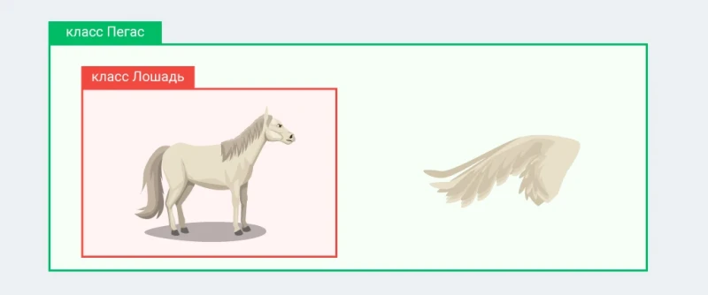

# **Prototype Inheritance in JavaScript**

---

## **4.1 Inheritance is Easy**

### **What is Inheritance?**



Inheritance is a core concept in Object-Oriented Programming (OOP) where:

> A **child object/class** gets properties and methods from a **parent object/class**.

---

### **Why Use Inheritance?**

Instead of rewriting code:

* ✅ Reuse existing functionality
* ✅ Extend behavior
* ✅ Improve code organization

---

### **Real-Life Analogy**

Creating a dog:

* ❌ From scratch → slow and complex
* ✅ From a wolf → faster and efficient

👉 Same idea in programming: reuse instead of rebuilding.

---

## **4.2 Prototype Inheritance Concept**

### **Key Idea**

JavaScript uses **prototypes** for inheritance.

> Every object has a hidden property `[[Prototype]]` that links to another object.

---

### **Simple Inheritance Example**

#### **Step 1: Base Object**

```javascript id="t6oj3n"
const animal = {
  eat() {
    console.log('Eating...');
  },

  sleep() {
    console.log('Sleeping...');
  }
};
```

---

#### **Step 2: Create Child Object**

```javascript id="gxb1c1"
const dog = Object.create(animal);

dog.bark = function() {
  console.log('Barking...');
};
```

---

#### **Step 3: Use Inheritance**

```javascript id="u2a0m6"
dog.eat();   // Eating...
dog.sleep(); // Sleeping...
dog.bark();  // Barking...
```

✅ `dog` inherits from `animal`

---

## **4.3 Deep Prototype Inheritance**

### **Prototype Chain**

Objects can inherit from other objects, forming a chain:

```id="px2lfu"
dog → mammal → animal → null
```

---

### **Example**

```javascript id="6qhl56"
const animal = {
  eat() {
    console.log('Eating...');
  }
};

const mammal = Object.create(animal);
mammal.walk = function() {
  console.log('Walking...');
};

const dog = Object.create(mammal);
dog.bark = function() {
  console.log('Barking...');
};

dog.eat();   // Eating...
dog.walk();  // Walking...
dog.bark();  // Barking...
```

---

### **Checking Prototype Chain**

```javascript id="5fpq9g"
console.log(animal.isPrototypeOf(mammal)); // true
console.log(mammal.isPrototypeOf(dog));    // true
console.log(animal.isPrototypeOf(dog));    // true
```

---

## **4.4 Overriding Methods**

### **What is Method Overriding?**

> A child object can **replace** a method from its parent.

---

### **Example**

```javascript id="g1r6g6"
const animal = {
  speak() {
    console.log('Animal speaks');
  }
};

const dog = Object.create(animal);

dog.speak = function() {
  console.log('Dog barks');
};

animal.speak(); // Animal speaks
dog.speak();    // Dog barks
```

---

### **Calling Parent Method**

```javascript id="r4fh3j"
const animal = {
  speak() {
    console.log('Animal speaks');
  }
};

const dog = Object.create(animal);

dog.speak = function() {
  animal.speak.call(this);
  console.log('Dog barks');
};

dog.speak();
```

✔ Output:

```
Animal speaks
Dog barks
```

---

## **4.5 Advanced Usage of Prototype Inheritance**

---

### **1. Extending Built-in Objects**

```javascript id="s7m92y"
Array.prototype.sum = function() {
  return this.reduce((acc, value) => acc + value, 0);
};

const numbers = [1, 2, 3, 4, 5];

console.log(numbers.sum()); // 15
```

---

### **2. Multi-Level Hierarchies**

```javascript id="7hxaqd"
const livingBeing = {
  breathe() {
    console.log('Breathing...');
  }
};

const animal = Object.create(livingBeing);
animal.eat = function() {
  console.log('Eating...');
};

const mammal = Object.create(animal);
mammal.walk = function() {
  console.log('Walking...');
};

const dog = Object.create(mammal);
dog.bark = function() {
  console.log('Barking...');
};

dog.breathe();
dog.eat();
dog.walk();
dog.bark();
```

---

## **Exercises with Solutions**

---

### **Exercise 1: Method Overriding**

#### **Task**

* Create `animal` with `speak()`
* Create `dog` inheriting from it
* Override method

---

#### ✅ **Solution**

```javascript id="mj6lrb"
const animal = {
  speak() {
    console.log("Animal speaks");
  }
};

const dog = Object.create(animal);

dog.speak = function() {
  console.log("Dog barks");
};

animal.speak(); // Animal speaks
dog.speak();    // Dog barks
```

---

### **Exercise 2: Add `sum()` to Array**

#### **Task**

* Add `sum()` method
* Return total

---

#### ✅ **Solution**

```javascript id="sdr6hf"
Array.prototype.sum = function() {
  return this.reduce((acc, value) => acc + value, 0);
};

const numbers = [1, 2, 3, 4, 5];

console.log(numbers.sum()); // 15
```

---

### **Exercise 3: Prototype Chain**

#### **Task**

Create:

* `organism → animal → bird`

---

#### ✅ **Solution**

```javascript id="w1wuhc"
const organism = {
  live() {
    console.log("Organism lives");
  }
};

const animal = Object.create(organism);
animal.move = function() {
  console.log("Animal moves");
};

const bird = Object.create(animal);
bird.fly = function() {
  console.log("Bird flies");
};

bird.live();
bird.move();
bird.fly();
```

---

### **Exercise 4: Check Prototype Relationship**

#### ✅ **Solution**

```javascript id="x9czif"
console.log(animal.isPrototypeOf(bird)); // true
console.log(organism.isPrototypeOf(bird)); // true
```

---

## **Key Takeaways**

* JavaScript uses **prototype-based inheritance**
* Objects inherit via **[[Prototype]]**
* Use:

    * `Object.create()` → create inheritance
    * `isPrototypeOf()` → check relationships
* Supports:

    * Method sharing
    * Method overriding
    * Deep inheritance chains

---

## **Final Insight**

> Prototype inheritance is the backbone of JavaScript.

Mastering it helps you:

* Understand **classes (`class`, `extends`)**
* Write **clean reusable code**
* Handle **real-world applications**

---

